# DBMS

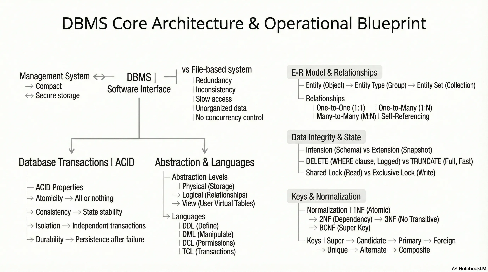

<div style="position:relative;width:100%;padding-bottom:56.25%;height:0;">
  <iframe
    src="https://www.youtube.com/embed/Q3uv7T8iLdg?si=TXGpe41WfN8cFYAb"
    title="YouTube video player"
    style="position:absolute;top:0;left:0;width:100%;height:100%;border:0;"
    allow="accelerometer; autoplay; clipboard-write; encrypted-media; gyroscope; picture-in-picture; web-share"
    referrerpolicy="strict-origin-when-cross-origin"
    allowfullscreen>
  </iframe>
</div>

## Basic DBMS Interview Questions

### 1. What is meant by DBMS and what is its utility? Explain RDBMS with examples.

**DBMS (Database Management System)**
*   **Definition:** A set of applications or programs that enable users to create and maintain a database.
*   **Utility:**
    *   Provides a tool or interface for performing various operations such as inserting, deleting, updating, etc., into a database.
    *   Enables the storage of data more compactly and securely compared to a file-based system.
    *   Helps users overcome problems like **data inconsistency** and **data redundancy** in a database.
    *   Makes using a database more convenient and organized.
*   **Examples:** File systems, XML, Windows Registry, etc.

**RDBMS (Relational Database Management System)**
*   **Definition:** Introduced in the 1970s to access and store data more efficiently than DBMS.
*   **Structure:** Stores data in the form of **tables** (rows and columns) compared to DBMS which stores data as files.
*   **Utility:** Storing data as rows and columns makes it easier to locate specific values in the database and makes it more efficient compared to DBMS.
*   **Examples:** MySQL, Oracle DB, etc.

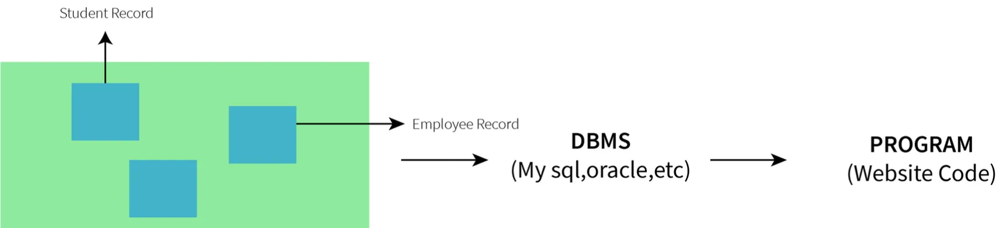

### 2. What is meant by a database?

*   **Definition:** An organized, consistent, and logical collection of data that can easily be updated, accessed, and managed.
*   **Content:** Mostly contains sets of tables or objects.
    *   **Object:** Anything created using the `create` command is a database object.
    *   **Records and Fields:** Tables consist of these.
*   **Tuple/Row:** Represents a single entry in a table.
*   **Attribute/Column:** Represents the basic units of data storage, containing information about a particular aspect of the table.
*   **Extraction:** DBMS extracts data from a database in the form of queries given by the user.

### 3. Mention the issues with traditional file-based systems that make DBMS a better choice?

*   **Absence of Indexing:** Leaves the only option of scanning the full page, making access to content tedious and super slow.
*   **Redundancy and Inconsistency:** Files have many duplicate and redundant data; changing one makes all of them inconsistent.
*   **Data Access:** Accessing data is harder because data is unorganized.
*   **Lack of Concurrency Control:** Leads to one operation locking the entire page, whereas DBMS allows multiple operations on a single file simultaneously.
*   **Other Issues:**
    *   Integrity check issues
    *   Data isolation issues
    *   Atomicity issues
    *   Security issues

### 4. Explain a few advantages of a DBMS.

*   **Data Sharing:** Data from a single database can be simultaneously shared by multiple users. This enables end-users to react to changes quickly in the database environment.
*   **Integrity Constraints:** The existence of these constraints allows storing data in an organized and refined manner.
*   **Controlling Redundancy:** Eliminates redundancy by providing a mechanism that integrates all data in a single database.
*   **Data Independence:** Allows changing the data structure without altering the composition of any executing application programs.
*   **Backup and Recovery:** Can be configured to automatically create a backup of data and restore it whenever required.
*   **Data Security:** Provides necessary tools to make storage and transfer reliable and secure.
    *   **Authentication:** The process of giving restricted access to a user.
    *   **Encryption:** Encrypting sensitive data such as OTP, credit card information, etc.

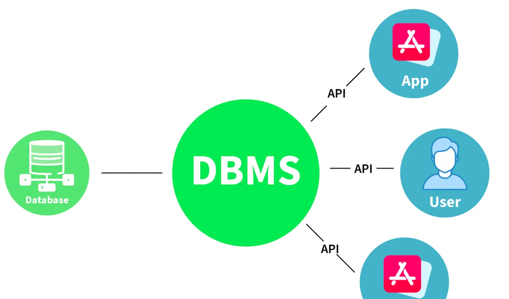

### 5. Explain different languages present in DBMS.

**DDL (Data Definition Language)**
*   Contains commands required to define the database.
*   **Examples:**
    ```sql
    CREATE, ALTER, DROP, TRUNCATE, RENAME
    ```

**DML (Data Manipulation Language)**
*   Contains commands required to manipulate the data present in the database.
*   **Examples:**
    ```sql
    SELECT, UPDATE, INSERT, DELETE
    ```

**DCL (Data Control Language)**
*   Contains commands required to deal with user permissions and controls of the database system.
*   **Examples:**
    ```sql
    GRANT, REVOKE
    ```

**TCL (Transaction Control Language)**
*   Contains commands required to deal with the transaction of the database.
*   **Examples:**
    ```sql
    COMMIT, ROLLBACK, SAVEPOINT
    ```

### 6. What is meant by ACID properties in DBMS?

ACID properties ensure a safe and secure way of sharing data among multiple users.

*   **A - Atomicity:**
    *   Reflects the concept of either executing the **whole query** or executing **nothing at all**.
    *   If an update occurs, it should either be reflected in the whole database or not reflected at all.
    *   In this Example
        *   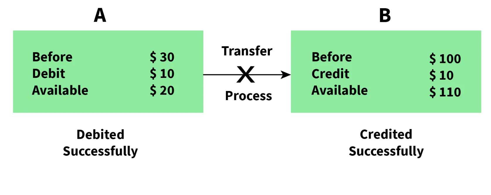
            *   Partial Execution
            *   No Atomicity
            *   Execution Termination
    *   In this Example
        *   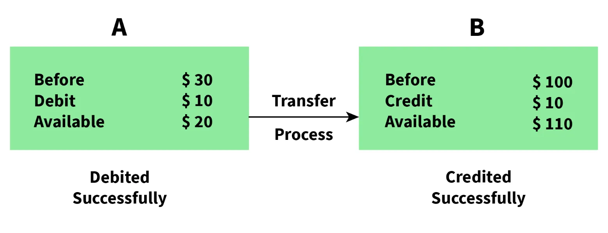
            *   Complete Execution
            *   Atomicity
            *   Execution Successfull
*   **C - Consistency:**
    *   Ensures that data remains consistent before and after a transaction.
    *   In this Example
        *   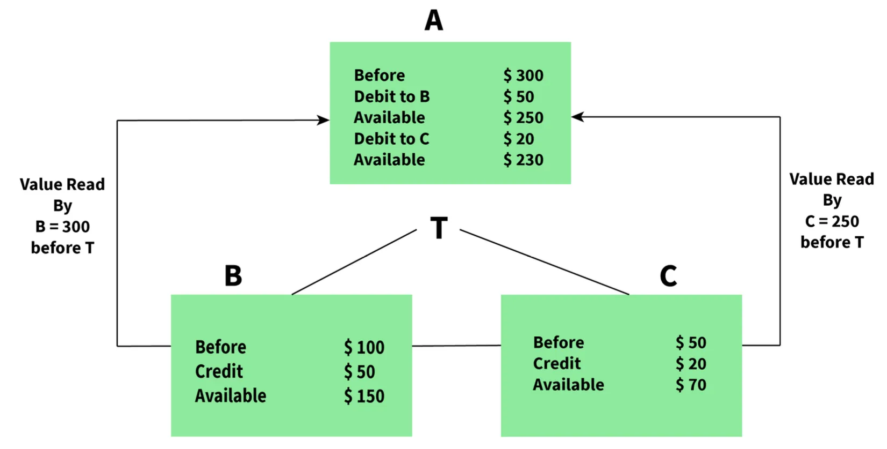
            *   Data is Consistent
*   **I - Isolation:**
    *   Ensures each transaction occurs independently of others.
    *   The state of an ongoing transaction does not affect the state of another ongoing transaction.
    *   In this Example
        *   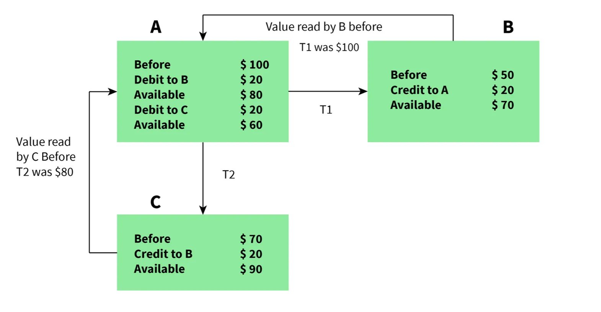
            *   Isolation, Independent Execution T1 and T2 by A
*   **D - Durability:**
    *   Ensures data is not lost in cases of system failure or restart.
    *   Data is present in the same state as it was before the failure/restart.

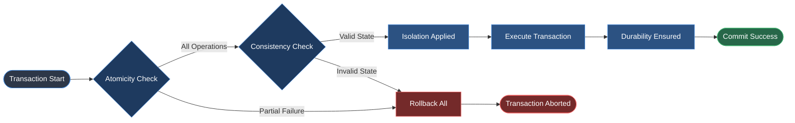
```mermaid
flowchart LR
    Start([Transaction Start]) --> A{Atomicity Check}
    A -->|All Operations| C{Consistency Check}
    A -->|Partial Failure| Rollback[Rollback All]
    C -->|Valid State| I[Isolation Applied]
    C -->|Invalid State| Rollback
    I --> Execute[Execute Transaction]
    Execute --> D[Durability Ensured]
    D --> Commit([Commit Success])
    Rollback --> Abort([Transaction Aborted])
    style Start fill:#2d3748,stroke:#4a90e2,color:#fff
    style Commit fill:#276749,stroke:#48bb78,color:#fff
    style Abort fill:#742a2a,stroke:#f56565,color:#fff
    style A fill:#1e3a5f,stroke:#4a90e2,color:#fff
    style C fill:#1e3a5f,stroke:#4a90e2,color:#fff
    style I fill:#2c5282,stroke:#4a90e2,color:#fff
    style Execute fill:#2c5282,stroke:#4a90e2,color:#fff
    style D fill:#2c5282,stroke:#4a90e2,color:#fff
    style Rollback fill:#742a2a,stroke:#f56565,color:#fff
```

### 7. Are NULL values in a database the same as that of blank space or zero?

*   **No**, a **NULL** value is very different from zero and blank space.
*   **NULL:** Represents a value that is assigned, unknown, unavailable, or not applicable.
*   **Blank Space:** Represents a character.
*   **Zero:** Represents a number.
*   **Example:** A NULL value in "number_of_courses" means the value is unknown, whereas 0 means the student has not taken any courses.

---

## Intermediate DBMS Interview Questions

### 8. What is meant by Data Warehousing?

*   **Definition:** The process of collecting, extracting, transforming, and loading data from multiple sources and storing them into one database.
*   **Function:**
    *   Acts as a central repository where data flows from transactional systems and other relational databases.
    *   Used for data analytics.
    *   Comprises a wide variety of an organization’s historical data.
    *   Supports the decision-making process in an organization.
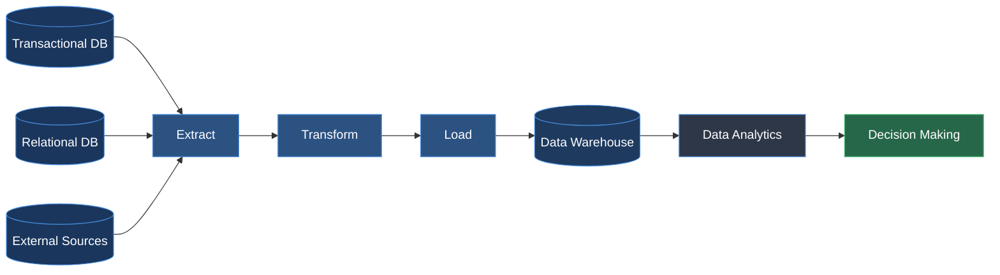
```mermaid
flowchart LR
    S1[(Transactional DB)] --> Extract[Extract]
    S2[(Relational DB)] --> Extract
    S3[(External Sources)] --> Extract
    Extract --> Transform[Transform]
    Transform --> Load[Load]
    Load --> DW[(Data Warehouse)]
    DW --> Analytics[Data Analytics]
    Analytics --> Decision[Decision Making]
    style S1 fill:#1a365d,stroke:#4a90e2,color:#fff
    style S2 fill:#1a365d,stroke:#4a90e2,color:#fff
    style S3 fill:#1a365d,stroke:#4a90e2,color:#fff
    style Extract fill:#2c5282,stroke:#4a90e2,color:#fff
    style Transform fill:#2c5282,stroke:#4a90e2,color:#fff
    style Load fill:#2c5282,stroke:#4a90e2,color:#fff
    style DW fill:#1e3a5f,stroke:#4a90e2,color:#fff
    style Analytics fill:#2d3748,stroke:#4a90e2,color:#fff
    style Decision fill:#276749,stroke:#48bb78,color:#fff
```

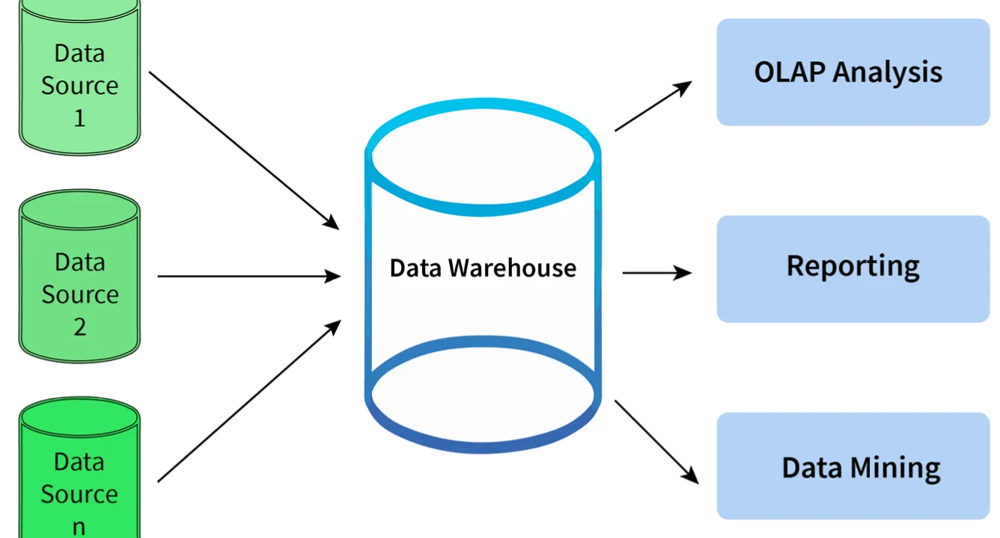

### 9. Explain different levels of data abstraction in a DBMS.

Data abstraction is the process of hiding irrelevant details from users. It is divided into 3 levels:

1.  **Physical Level:**
    *   The lowest level, managed by DBMS.
    *   Consists of data storage descriptions.
    *   Details are typically hidden from system admins, developers, and users.
2.  **Conceptual or Logical Level:**
    *   Level on which developers and system admins work.
    *   Determines **what** data is stored and the **relationships** between data points.
3.  **External or View Level:**
    *   Describes only part of the database.
    *   Hides details of table schema and physical storage from users.
    *   **Example:** The result of a query is View level data abstraction. A **view** is a virtual table created by selecting fields from one or more tables.

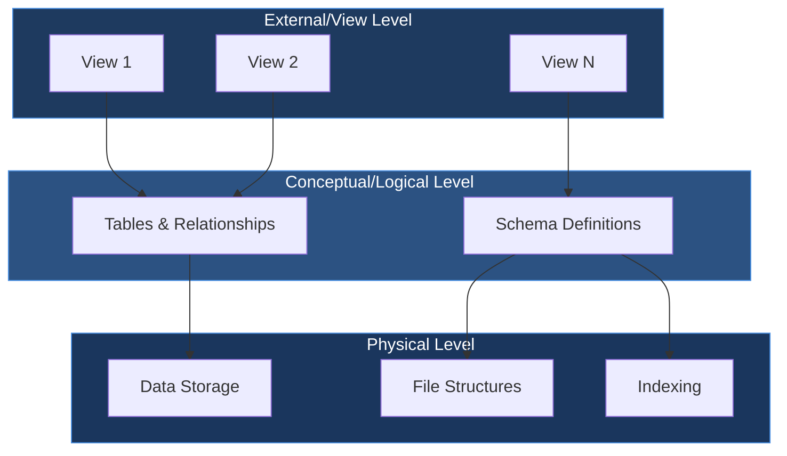
```mermaid
flowchart TB
    subgraph External["External/View Level"]
        V1[View 1]
        V2[View 2]
        V3[View N]
    end
    subgraph Conceptual["Conceptual/Logical Level"]
        L1[Tables & Relationships]
        L2[Schema Definitions]
    end
    subgraph Physical["Physical Level"]
        P1[Data Storage]
        P2[File Structures]
        P3[Indexing]
    end
    V1 --> L1
    V2 --> L1
    V3 --> L2
    L1 --> P1
    L2 --> P2
    L2 --> P3
    style External fill:#1e3a5f,stroke:#4a90e2,color:#fff
    style Conceptual fill:#2c5282,stroke:#4a90e2,color:#fff
    style Physical fill:#1a365d,stroke:#4a90e2,color:#fff
```

### 10. What is meant by an entity-relationship (E-R) model? Explain the terms Entity, Entity Type, and Entity Set in DBMS.

*   **E-R Model:** A diagrammatic approach to database design where real-world objects are represented as entities and relationships between them are mentioned.

**Terms:**
*   **Entity:** A real-world object having attributes that represent characteristics of that particular object.
    *   *Example:* A student, an employee, or a teacher.
*   **Entity Type:** A collection of entities that have the same attributes.
    *   One or more related tables in a database represent an entity type.
    *   Attributes uniquely identify the entity.
    *   *Example:* A student entity type has attributes like `student_id`, `student_name`, etc.
*   **Entity Set:** A set of **all** the entities present in a specific entity type in a database.
    *   *Example:* A set of all students, employees, teachers, etc.

Example: Student Management System Sample
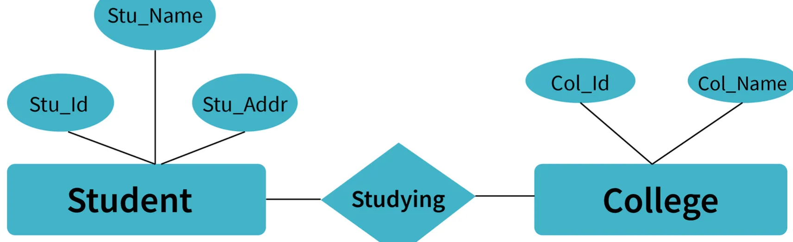

Example: Hospital Management System Sample
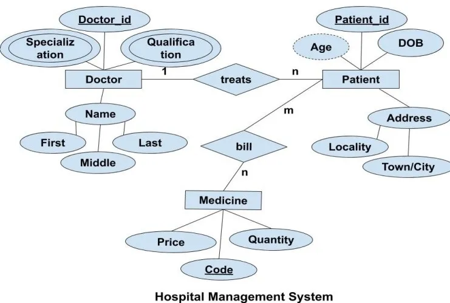

### 11. Explain different types of relationships amongst tables in a DBMS.

*   **One to One Relationship:** Applied when a particular row in table X is linked to a **singular** row in table Y.
    *   
*   **One to Many Relationship:** Applied when a **single** row in table X is related to **many** rows in table Y.
    *   
*   **Many to Many Relationship:** Applied when **multiple** rows in table X can be linked to **multiple** rows in table Y.
    *   
*   **Self Referencing Relationship:** Applied when a particular row in table X is associated with the **same** table.
    *   

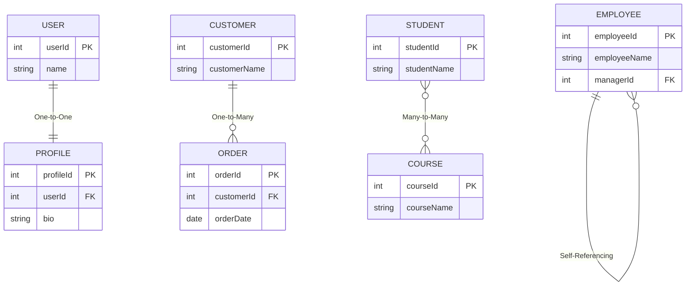
```mermaid
erDiagram
    USER ||--|| PROFILE : "One-to-One"
    USER {
        int userId PK
        string name
    }
    PROFILE {
        int profileId PK
        int userId FK
        string bio
    }
    
    CUSTOMER ||--o{ ORDER : "One-to-Many"
    CUSTOMER {
        int customerId PK
        string customerName
    }
    ORDER {
        int orderId PK
        int customerId FK
        date orderDate
    }
    
    STUDENT }o--o{ COURSE : "Many-to-Many"
    STUDENT {
        int studentId PK
        string studentName
    }
    COURSE {
        int courseId PK
        string courseName
    }
    
    EMPLOYEE ||--o{ EMPLOYEE : "Self-Referencing"
    EMPLOYEE {
        int employeeId PK
        string employeeName
        int managerId FK
    }
```

### 12. Explain the difference between intension and extension in a database.

*   **Intension (Database Schema):**
    *   Used to define the description of the database.
    *   Specified during the design of the database.
    *   Mostly remains unchanged.
*   **Extension (Snapshot):**
    *   The measure of the number of tuples present in the database at any given point in time.
    *   Value keeps changing as tuples are created, updated, or destroyed.

### 13. Explain the difference between the DELETE and TRUNCATE command in a DBMS.

**DELETE Command**
*   Needed to delete rows from a table based on the condition provided by the `WHERE` clause.
*   Deletes only rows specified by the `WHERE` clause.
*   Can be rolled back if required.
*   Maintains a log to lock the row of the table before deleting it; hence, it is **slow**.

**TRUNCATE Command**
*   Needed to remove complete data from a table.
*   Like a DELETE command with **no** `WHERE` clause.
*   Removes complete data from a table.
*   Can be rolled back even if required.
*   Does **not** maintain a log and deletes the whole table at once; hence, it is **fast**.

### 14. What is a lock? Explain the major difference between a shared lock and an exclusive lock during a transaction in a database.

*   **Lock:** A mechanism to protect a shared piece of data from getting updated by two or more database users at the same time. When a single user/session acquires a lock, no other user/session can modify that data until the lock is released.

**Shared Lock**
*   Required for **reading** a data item.
*   Many transactions may hold a lock on the same data item.
*   Multiple transactions are **allowed** to read data items.

**Exclusive Lock**
*   Required for any transaction about to perform a **write** operation.
*   Does **not** allow more than one transaction.
*   Prevents inconsistency in the database.

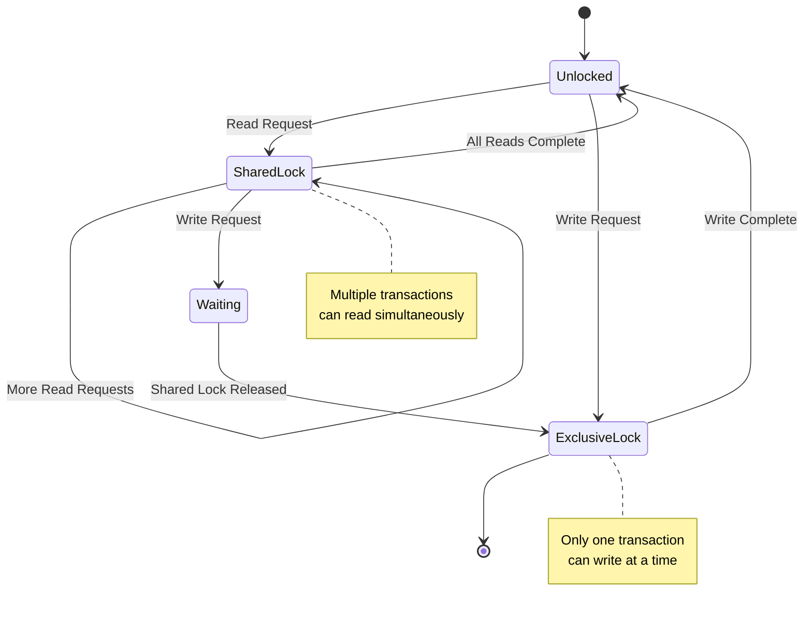
```mermaid
stateDiagram-v2
    [*] --> Unlocked
    Unlocked --> SharedLock : Read Request
    Unlocked --> ExclusiveLock : Write Request
    SharedLock --> SharedLock : More Read Requests
    SharedLock --> Unlocked : All Reads Complete
    SharedLock --> Waiting : Write Request
    ExclusiveLock --> Unlocked : Write Complete
    Waiting --> ExclusiveLock : Shared Lock Released
    ExclusiveLock --> [*]
    
    note right of SharedLock
        Multiple transactions
        can read simultaneously
    end note
    
    note right of ExclusiveLock
        Only one transaction
        can write at a time
    end note
```

### 15. What is meant by normalization and denormalization?

*   **Normalization:**
    *   A process of reducing redundancy by organizing data into multiple tables.
    *   Leads to better usage of disk spaces.
    *   Makes it easier to maintain database integrity.
*   **Denormalization:**
    *   The reverse process of normalization.
    *   Combines tables which have been normalized into a single table.
    *   Makes data retrieval **faster**.
    *   **JOIN** operation allows creating a denormalized form by reversing normalization.

---

## Advanced DBMS Interview Questions

### 16. Explain different types of Normalization forms in a DBMS.

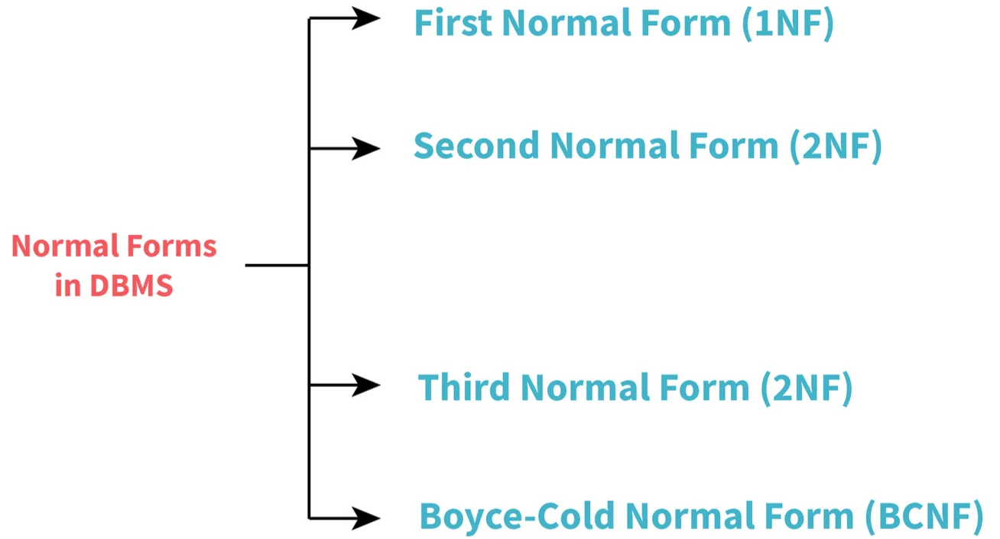

Reference Example Sample:
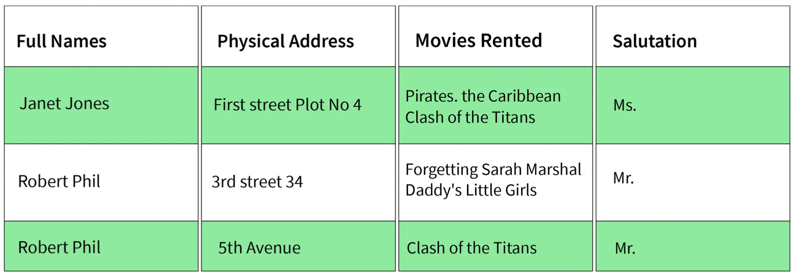

**1. First Normal Form (1NF)**
*   Simplest type. Conditions:
    *   Every column must have a **single value** and should be **atomic**.
    *   **Duplicate columns** from the same table should be removed.
    *   Separate tables should be created for each group of related data.
    *   Each row should be identified with a **unique column**.

Sample's 1NF form:
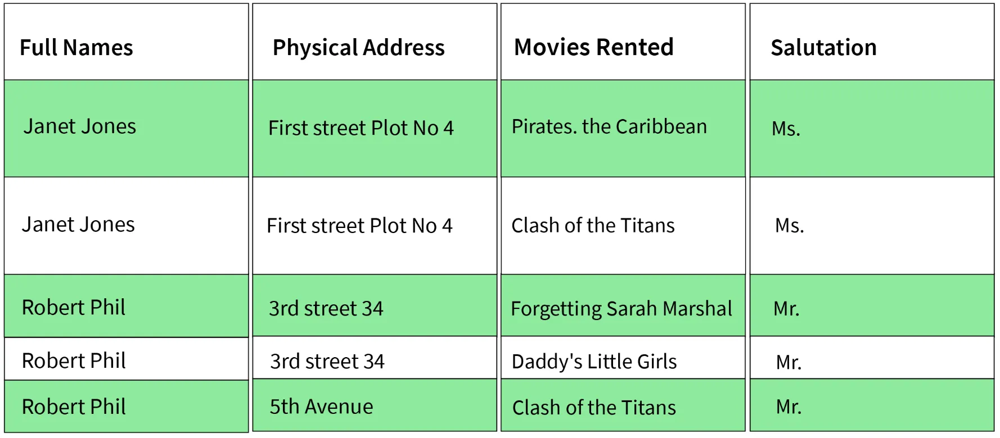

**2. Second Normal Form (2NF)**
*   Conditions:
    *   Table must be in **1NF**.
    *   Every **non-prime attribute** should be **fully functionally dependent** on the primary key.
    *   *Explanation:* Every non-key attribute must depend on the primary key such that if any key element is deleted, the non-key element will be saved.

Sample's 2NF form:
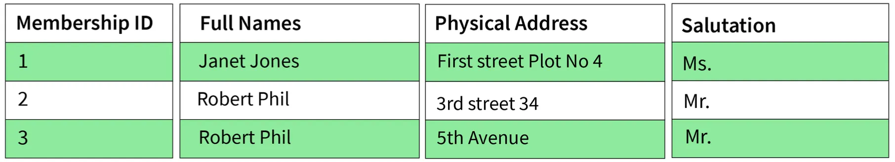
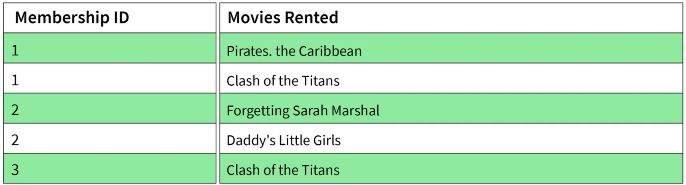


**3. Third Normal Form (3NF)**
*   Conditions:
    *   Table must be in **2NF**.
    *   There is **no transitive functional dependency** of one attribute on any attribute in the same table.

Sample's 3NF form:
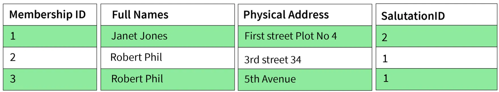

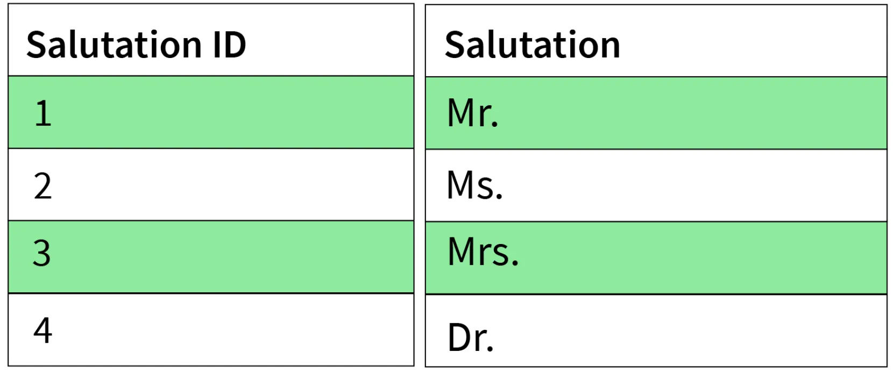

**4. Boyce-Codd Normal Form (BCNF) / 3.5NF**
*   Advanced form of 3NF. Conditions:
    *   Table must be in **3NF**.
    *   For every functional dependency `A -> B`, **A** should be the **super key** of the table.
    *   *Implication:* A can't be a non-prime attribute if B is a prime attribute.


```mermaid
flowchart LR
    Unnormalized[Unnormalized Data] --> 1NF
    1NF["1NF<br/>Atomic Values<br/>Unique Rows"] --> 2NF
    2NF["2NF<br/>1NF +<br/>Full Functional Dependency"] --> 3NF
    3NF["3NF<br/>2NF +<br/>No Transitive Dependency"] --> BCNF
    BCNF["BCNF<br/>3NF +<br/>Determinant is Super Key"]
    style Unnormalized fill:#742a2a,stroke:#f56565,color:#fff
    style 1NF fill:#2c5282,stroke:#4a90e2,color:#fff
    style 2NF fill:#2c5282,stroke:#4a90e2,color:#fff
    style 3NF fill:#2c5282,stroke:#4a90e2,color:#fff
    style BCNF fill:#276749,stroke:#48bb78,color:#fff
```

### 17. Explain different types of keys in a database.

**1. Candidate Key**
*   A set of properties that can uniquely identify a table.
*   Each table may have multiple candidate keys.
*   One key amongst them is chosen as the primary key.
*   *Example:* `studentId` and `firstName` can both be Candidate Keys if they uniquely identify every tuple.

**2. Super Key**
*   A set of attributes that can uniquely identify a tuple.
*   Candidate key and primary key are **subsets** of the super key (the super key is their superset).

**3. Primary Key**
*   A set of attributes used to uniquely identify every tuple.
*   Chosen from the candidate keys.
*   Does **not** allow NULL values.
*   *Example:* `studentId` chosen over `firstName` for the student table.

**4. Unique Key**
*   Similar to primary key but **allows NULL values** in the column.
*   Essentially primary keys with NULL values.

**5. Alternate Key**
*   All candidate keys **not** chosen as primary keys.
*   *Example:* If `studentId` is Primary, `firstName` and `lastname` are alternate keys.

**6. Foreign Key**
*   An attribute that can only take values present in one table common to the attribute present in another table.
*   *Example:* `courseId` in the Student table is a foreign key to the Course table.

**7. Composite Key**
*   A combination of **two or more columns** that can uniquely identify each tuple in a table.
*   *Example:* Grouping `studentId` and `firstname`.

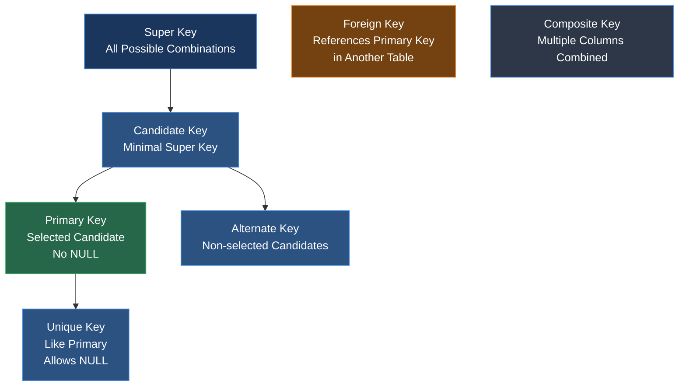
```mermaid
flowchart TB
    SK[Super Key<br/>All Possible Combinations] --> CK
    CK[Candidate Key<br/>Minimal Super Key] --> PK
    CK --> AK
    PK[Primary Key<br/>Selected Candidate<br/>No NULL] --> UK
    AK[Alternate Key<br/>Non-selected Candidates]
    UK[Unique Key<br/>Like Primary<br/>Allows NULL]
    FK[Foreign Key<br/>References Primary Key<br/>in Another Table]
    COMP[Composite Key<br/>Multiple Columns Combined]
    style SK fill:#1a365d,stroke:#4a90e2,color:#fff
    style CK fill:#2c5282,stroke:#4a90e2,color:#fff
    style PK fill:#276749,stroke:#48bb78,color:#fff
    style AK fill:#2c5282,stroke:#4a90e2,color:#fff
    style UK fill:#2c5282,stroke:#4a90e2,color:#fff
    style FK fill:#744210,stroke:#ed8936,color:#fff
    style COMP fill:#2d3748,stroke:#4a90e2,color:#fff
```

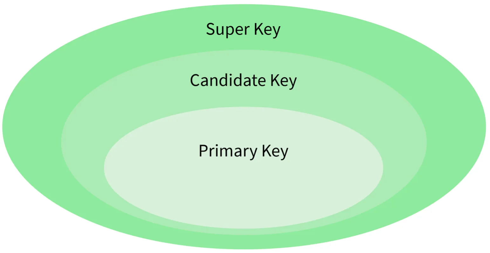

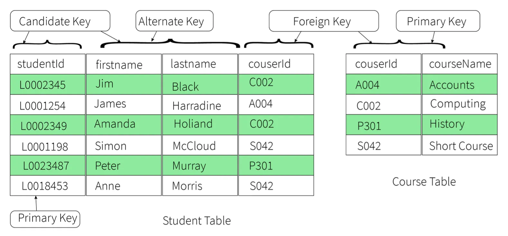

### 18. Explain the difference between a 2-tier and 3-tier architecture in a DBMS.

**2-Tier Architecture**
*   **Client-Server architecture.**
*   Applications at the client end **directly communicate** with the database at the server end.
*   **No middleware** involved.
*   **Examples:** Contact Management System created using MS-Access, Railway Reservation System.

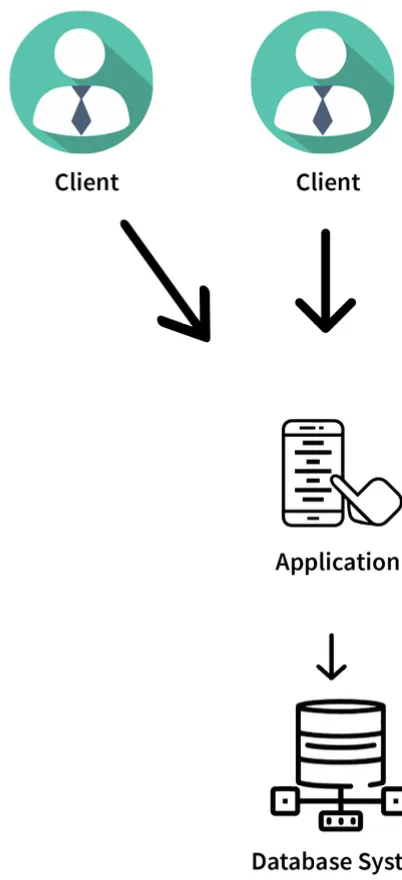

**3-Tier Architecture**
*   Contains another layer (**Middleware**) between the client and the server.
*   Provides **GUI** to users.
*   Makes the system much more secure and accessible.
*   **Flow:** Client Application <-> Server Application <-> Database System.
*   **Examples:** Designing registration forms (text box, label, button), large websites on the Internet.

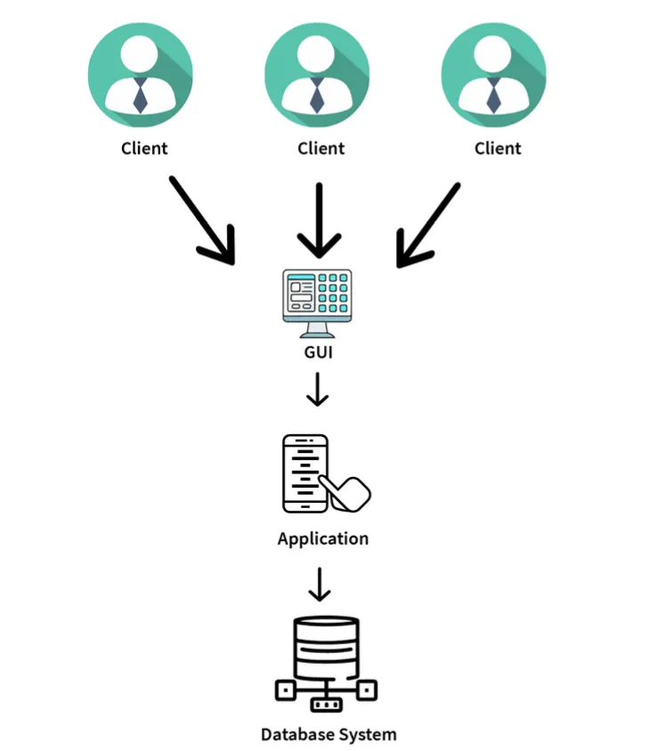

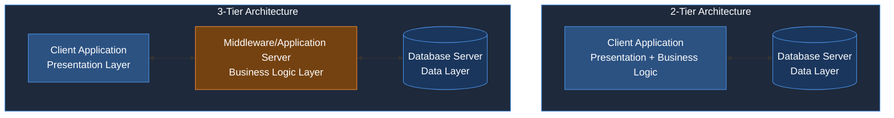
```mermaid
flowchart TB
    subgraph TwoTier["2-Tier Architecture"]
        C1[Client Application<br/>Presentation + Business Logic]
        D1[(Database Server<br/>Data Layer)]
        C1 <--> D1
    end
    
    subgraph ThreeTier["3-Tier Architecture"]
        C2[Client Application<br/>Presentation Layer]
        M[Middleware/Application Server<br/>Business Logic Layer]
        D2[(Database Server<br/>Data Layer)]
        C2 <--> M
        M <--> D2
    end
    
    style C1 fill:#2c5282,stroke:#4a90e2,color:#fff
    style D1 fill:#1a365d,stroke:#4a90e2,color:#fff
    style C2 fill:#2c5282,stroke:#4a90e2,color:#fff
    style M fill:#744210,stroke:#ed8936,color:#fff
    style D2 fill:#1a365d,stroke:#4a90e2,color:#fff
    style TwoTier fill:#1e293b,stroke:#4a90e2,color:#fff
    style ThreeTier fill:#1e293b,stroke:#4a90e2,color:#fff
```

## Complete DBMS Roadmap

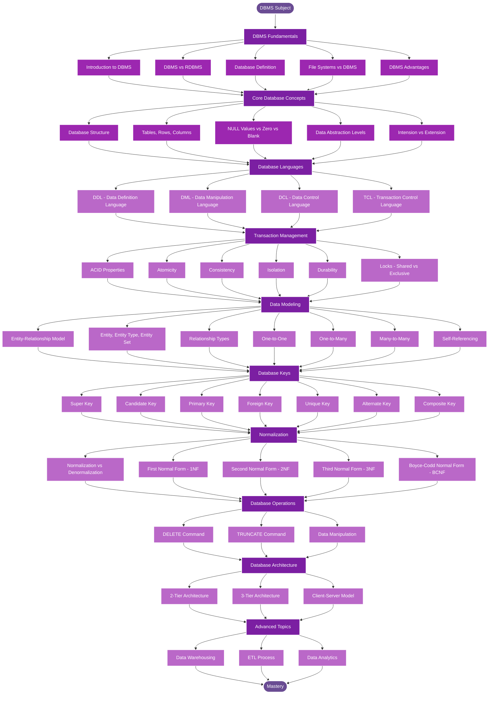
```mermaid
flowchart TD
    Start([DBMS Subject]) --> Fundamentals
    
    Fundamentals[DBMS Fundamentals] --> F1[Introduction to DBMS]
    Fundamentals --> F2[DBMS vs RDBMS]
    Fundamentals --> F3[Database Definition]
    Fundamentals --> F4[File Systems vs DBMS]
    Fundamentals --> F5[DBMS Advantages]
    
    F1 --> Core
    F2 --> Core
    F3 --> Core
    F4 --> Core
    F5 --> Core
    
    Core[Core Database Concepts] --> C1[Database Structure]
    Core --> C2[Tables, Rows, Columns]
    Core --> C3[NULL Values vs Zero vs Blank]
    Core --> C4[Data Abstraction Levels]
    Core --> C5[Intension vs Extension]
    
    C1 --> Languages
    C2 --> Languages
    C3 --> Languages
    C4 --> Languages
    C5 --> Languages
    
    Languages[Database Languages] --> L1[DDL - Data Definition Language]
    Languages --> L2[DML - Data Manipulation Language]
    Languages --> L3[DCL - Data Control Language]
    Languages --> L4[TCL - Transaction Control Language]
    
    L1 --> Transactions
    L2 --> Transactions
    L3 --> Transactions
    L4 --> Transactions
    
    Transactions[Transaction Management] --> T1[ACID Properties]
    Transactions --> T2[Atomicity]
    Transactions --> T3[Consistency]
    Transactions --> T4[Isolation]
    Transactions --> T5[Durability]
    Transactions --> T6[Locks - Shared vs Exclusive]
    
    T1 --> Modeling
    T2 --> Modeling
    T3 --> Modeling
    T4 --> Modeling
    T5 --> Modeling
    T6 --> Modeling
    
    Modeling[Data Modeling] --> M1[Entity-Relationship Model]
    Modeling --> M2[Entity, Entity Type, Entity Set]
    Modeling --> M3[Relationship Types]
    Modeling --> M4[One-to-One]
    Modeling --> M5[One-to-Many]
    Modeling --> M6[Many-to-Many]
    Modeling --> M7[Self-Referencing]
    
    M1 --> Keys
    M2 --> Keys
    M3 --> Keys
    M4 --> Keys
    M5 --> Keys
    M6 --> Keys
    M7 --> Keys
    
    Keys[Database Keys] --> K1[Super Key]
    Keys --> K2[Candidate Key]
    Keys --> K3[Primary Key]
    Keys --> K4[Foreign Key]
    Keys --> K5[Unique Key]
    Keys --> K6[Alternate Key]
    Keys --> K7[Composite Key]
    
    K1 --> Normalization
    K2 --> Normalization
    K3 --> Normalization
    K4 --> Normalization
    K5 --> Normalization
    K6 --> Normalization
    K7 --> Normalization
    
    Normalization[Normalization] --> N1[Normalization vs Denormalization]
    Normalization --> N2[First Normal Form - 1NF]
    Normalization --> N3[Second Normal Form - 2NF]
    Normalization --> N4[Third Normal Form - 3NF]
    Normalization --> N5[Boyce-Codd Normal Form - BCNF]
    
    N1 --> Operations
    N2 --> Operations
    N3 --> Operations
    N4 --> Operations
    N5 --> Operations
    
    Operations[Database Operations] --> O1[DELETE Command]
    Operations --> O2[TRUNCATE Command]
    Operations --> O3[Data Manipulation]
    
    O1 --> Architecture
    O2 --> Architecture
    O3 --> Architecture
    
    Architecture[Database Architecture] --> A1[2-Tier Architecture]
    Architecture --> A2[3-Tier Architecture]
    Architecture --> A3[Client-Server Model]
    
    A1 --> Advanced
    A2 --> Advanced
    A3 --> Advanced
    
    Advanced[Advanced Topics] --> AD1[Data Warehousing]
    Advanced --> AD2[ETL Process]
    Advanced --> AD3[Data Analytics]
    
    AD1 --> End([Mastery])
    AD2 --> End
    AD3 --> End
    
    style Start fill:#6a4c93,stroke:#ffffff,color:#ffffff,stroke-width:3px
    style Fundamentals fill:#7b1fa2,stroke:#ffffff,color:#ffffff,stroke-width:2px
    style Core fill:#7b1fa2,stroke:#ffffff,color:#ffffff,stroke-width:2px
    style Languages fill:#7b1fa2,stroke:#ffffff,color:#ffffff,stroke-width:2px
    style Transactions fill:#7b1fa2,stroke:#ffffff,color:#ffffff,stroke-width:2px
    style Modeling fill:#7b1fa2,stroke:#ffffff,color:#ffffff,stroke-width:2px
    style Keys fill:#7b1fa2,stroke:#ffffff,color:#ffffff,stroke-width:2px
    style Normalization fill:#7b1fa2,stroke:#ffffff,color:#ffffff,stroke-width:2px
    style Operations fill:#7b1fa2,stroke:#ffffff,color:#ffffff,stroke-width:2px
    style Architecture fill:#7b1fa2,stroke:#ffffff,color:#ffffff,stroke-width:2px
    style Advanced fill:#7b1fa2,stroke:#ffffff,color:#ffffff,stroke-width:2px
    style End fill:#6a4c93,stroke:#ffffff,color:#ffffff,stroke-width:3px
    
    style F1 fill:#9c27b0,stroke:#ffffff,color:#ffffff
    style F2 fill:#9c27b0,stroke:#ffffff,color:#ffffff
    style F3 fill:#9c27b0,stroke:#ffffff,color:#ffffff
    style F4 fill:#9c27b0,stroke:#ffffff,color:#ffffff
    style F5 fill:#9c27b0,stroke:#ffffff,color:#ffffff
    
    style C1 fill:#9c27b0,stroke:#ffffff,color:#ffffff
    style C2 fill:#9c27b0,stroke:#ffffff,color:#ffffff
    style C3 fill:#9c27b0,stroke:#ffffff,color:#ffffff
    style C4 fill:#9c27b0,stroke:#ffffff,color:#ffffff
    style C5 fill:#9c27b0,stroke:#ffffff,color:#ffffff
    
    style L1 fill:#ba68c8,stroke:#ffffff,color:#ffffff
    style L2 fill:#ba68c8,stroke:#ffffff,color:#ffffff
    style L3 fill:#ba68c8,stroke:#ffffff,color:#ffffff
    style L4 fill:#ba68c8,stroke:#ffffff,color:#ffffff
    
    style T1 fill:#ba68c8,stroke:#ffffff,color:#ffffff
    style T2 fill:#ba68c8,stroke:#ffffff,color:#ffffff
    style T3 fill:#ba68c8,stroke:#ffffff,color:#ffffff
    style T4 fill:#ba68c8,stroke:#ffffff,color:#ffffff
    style T5 fill:#ba68c8,stroke:#ffffff,color:#ffffff
    style T6 fill:#ba68c8,stroke:#ffffff,color:#ffffff
    
    style M1 fill:#ba68c8,stroke:#ffffff,color:#ffffff
    style M2 fill:#ba68c8,stroke:#ffffff,color:#ffffff
    style M3 fill:#ba68c8,stroke:#ffffff,color:#ffffff
    style M4 fill:#ba68c8,stroke:#ffffff,color:#ffffff
    style M5 fill:#ba68c8,stroke:#ffffff,color:#ffffff
    style M6 fill:#ba68c8,stroke:#ffffff,color:#ffffff
    style M7 fill:#ba68c8,stroke:#ffffff,color:#ffffff
    
    style K1 fill:#ba68c8,stroke:#ffffff,color:#ffffff
    style K2 fill:#ba68c8,stroke:#ffffff,color:#ffffff
    style K3 fill:#ba68c8,stroke:#ffffff,color:#ffffff
    style K4 fill:#ba68c8,stroke:#ffffff,color:#ffffff
    style K5 fill:#ba68c8,stroke:#ffffff,color:#ffffff
    style K6 fill:#ba68c8,stroke:#ffffff,color:#ffffff
    style K7 fill:#ba68c8,stroke:#ffffff,color:#ffffff
    
    style N1 fill:#ba68c8,stroke:#ffffff,color:#ffffff
    style N2 fill:#ba68c8,stroke:#ffffff,color:#ffffff
    style N3 fill:#ba68c8,stroke:#ffffff,color:#ffffff
    style N4 fill:#ba68c8,stroke:#ffffff,color:#ffffff
    style N5 fill:#ba68c8,stroke:#ffffff,color:#ffffff
    
    style O1 fill:#ba68c8,stroke:#ffffff,color:#ffffff
    style O2 fill:#ba68c8,stroke:#ffffff,color:#ffffff
    style O3 fill:#ba68c8,stroke:#ffffff,color:#ffffff
    
    style A1 fill:#ba68c8,stroke:#ffffff,color:#ffffff
    style A2 fill:#ba68c8,stroke:#ffffff,color:#ffffff
    style A3 fill:#ba68c8,stroke:#ffffff,color:#ffffff
    
    style AD1 fill:#ba68c8,stroke:#ffffff,color:#ffffff
    style AD2 fill:#ba68c8,stroke:#ffffff,color:#ffffff
    style AD3 fill:#ba68c8,stroke:#ffffff,color:#ffffff
```