# DBMS


<div style="position:relative;width:100%;padding-bottom:56.25%;height:0;">
  <iframe
    src="https://www.youtube.com/embed/Q3uv7T8iLdg?si=TXGpe41WfN8cFYAb"
    title="YouTube video player"
    style="position:absolute;top:0;left:0;width:100%;height:100%;border:0;"
    allow="accelerometer; autoplay; clipboard-write; encrypted-media; gyroscope; picture-in-picture; web-share"
    referrerpolicy="strict-origin-when-cross-origin"
    allowfullscreen>
  </iframe>
</div>

## Basic DBMS Interview Questions

### 1. What is meant by DBMS and what is its utility? Explain RDBMS with examples.

**DBMS (Database Management System)**

*   **Definition:** A set of applications or programs that enable users to create and maintain a database.
*   **Utility:**
    *   Provides a tool or interface for performing various operations such as inserting, deleting, updating, etc., into a database.
    *   Enables the storage of data more compactly and securely compared to a file-based system.
    *   Helps users overcome problems like **data inconsistency** and **data redundancy** in a database.
    *   Makes using a database more convenient and organized.
*   **Examples:** File systems, XML, Windows Registry, etc.

**RDBMS (Relational Database Management System)**

*   **Definition:** Introduced in the 1970s to access and store data more efficiently than DBMS.
*   **Structure:** Stores data in the form of **tables** (rows and columns) compared to DBMS which stores data as files.
*   **Utility:** Storing data as rows and columns makes it easier to locate specific values in the database and makes it more efficient compared to DBMS.
*   **Examples:** MySQL, Oracle DB, etc.


### 2. What is meant by a database?

*   **Definition:** An organized, consistent, and logical collection of data that can easily be updated, accessed, and managed.
*   **Content:** Mostly contains sets of tables or objects.
    *   **Object:** Anything created using the `create` command is a database object.
    *   **Records and Fields:** Tables consist of these.
*   **Tuple/Row:** Represents a single entry in a table.
*   **Attribute/Column:** Represents the basic units of data storage, containing information about a particular aspect of the table.
*   **Extraction:** DBMS extracts data from a database in the form of queries given by the user.

### 3. Mention the issues with traditional file-based systems that make DBMS a better choice?

*   **Absence of Indexing:** Leaves the only option of scanning the full page, making access to content tedious and super slow.
*   **Redundancy and Inconsistency:** Files have many duplicate and redundant data; changing one makes all of them inconsistent.
*   **Data Access:** Accessing data is harder because data is unorganized.
*   **Lack of Concurrency Control:** Leads to one operation locking the entire page, whereas DBMS allows multiple operations on a single file simultaneously.
*   **Other Issues:**
    *   Integrity check issues
    *   Data isolation issues
    *   Atomicity issues
    *   Security issues

### 4. Explain a few advantages of a DBMS.

*   **Data Sharing:** Data from a single database can be simultaneously shared by multiple users. This enables end-users to react to changes quickly in the database environment.
*   **Integrity Constraints:** The existence of these constraints allows storing data in an organized and refined manner.
*   **Controlling Redundancy:** Eliminates redundancy by providing a mechanism that integrates all data in a single database.
*   **Data Independence:** Allows changing the data structure without altering the composition of any executing application programs.
*   **Backup and Recovery:** Can be configured to automatically create a backup of data and restore it whenever required.
*   **Data Security:** Provides necessary tools to make storage and transfer reliable and secure.
    *   **Authentication:** The process of giving restricted access to a user.
    *   **Encryption:** Encrypting sensitive data such as OTP, credit card information, etc.


### 5. Explain different languages present in DBMS.

**DDL (Data Definition Language)**

*   Contains commands required to define the database.
*   **Examples:**
    ```sql
    CREATE, ALTER, DROP, TRUNCATE, RENAME
    ```

**DML (Data Manipulation Language)**

*   Contains commands required to manipulate the data present in the database.
*   **Examples:**
    ```sql
    SELECT, UPDATE, INSERT, DELETE
    ```

**DCL (Data Control Language)**

*   Contains commands required to deal with user permissions and controls of the database system.
*   **Examples:**
    ```sql
    GRANT, REVOKE
    ```

**TCL (Transaction Control Language)**

*   Contains commands required to deal with the transaction of the database.
*   **Examples:**
    ```sql
    COMMIT, ROLLBACK, SAVEPOINT
    ```

### 6. What is meant by ACID properties in DBMS?

ACID properties ensure a safe and secure way of sharing data among multiple users.

*   **A - Atomicity:**
    *   Reflects the concept of either executing the **whole query** or executing **nothing at all**.
    *   If an update occurs, it should either be reflected in the whole database or not reflected at all.
    *   In this Example
        *   
            *   Partial Execution
            *   No Atomicity
            *   Execution Termination
    *   In this Example
        *   
            *   Complete Execution
            *   Atomicity
            *   Execution Successfull
*   **C - Consistency:**
    *   Ensures that data remains consistent before and after a transaction.
    *   In this Example
        *   
            *   Data is Consistent
*   **I - Isolation:**
    *   Ensures each transaction occurs independently of others.
    *   The state of an ongoing transaction does not affect the state of another ongoing transaction.
    *   In this Example
        *   
            *   Isolation, Independent Execution T1 and T2 by A
*   **D - Durability:**
    *   Ensures data is not lost in cases of system failure or restart.
    *   Data is present in the same state as it was before the failure/restart.


### 7. Are NULL values in a database the same as that of blank space or zero?

*   **No**, a **NULL** value is very different from zero and blank space.
*   **NULL:** Represents a value that is assigned, unknown, unavailable, or not applicable.
*   **Blank Space:** Represents a character.
*   **Zero:** Represents a number.
*   **Example:** A NULL value in "number_of_courses" means the value is unknown, whereas 0 means the student has not taken any courses.

---

## Intermediate DBMS Interview Questions

### 8. What is meant by Data Warehousing?

*   **Definition:** The process of collecting, extracting, transforming, and loading data from multiple sources and storing them into one database.
*   **Function:**
    *   Acts as a central repository where data flows from transactional systems and other relational databases.
    *   Used for data analytics.
    *   Comprises a wide variety of an organization’s historical data.
    *   Supports the decision-making process in an organization.


### 9. Explain different levels of data abstraction in a DBMS.

Data abstraction is the process of hiding irrelevant details from users. It is divided into 3 levels:

1.  **Physical Level:**
    *   The lowest level, managed by DBMS.
    *   Consists of data storage descriptions.
    *   Details are typically hidden from system admins, developers, and users.
2.  **Conceptual or Logical Level:**
    *   Level on which developers and system admins work.
    *   Determines **what** data is stored and the **relationships** between data points.
3.  **External or View Level:**
    *   Describes only part of the database.
    *   Hides details of table schema and physical storage from users.
    *   **Example:** The result of a query is View level data abstraction. A **view** is a virtual table created by selecting fields from one or more tables.


### 10. What is meant by an entity-relationship (E-R) model? Explain the terms Entity, Entity Type, and Entity Set in DBMS.

*   **E-R Model:** A diagrammatic approach to database design where real-world objects are represented as entities and relationships between them are mentioned.

**Terms:**

*   **Entity:** A real-world object having attributes that represent characteristics of that particular object.
    *   *Example:* A student, an employee, or a teacher.
*   **Entity Type:** A collection of entities that have the same attributes.
    *   One or more related tables in a database represent an entity type.
    *   Attributes uniquely identify the entity.
    *   *Example:* A student entity type has attributes like `student_id`, `student_name`, etc.
*   **Entity Set:** A set of **all** the entities present in a specific entity type in a database.
    *   *Example:* A set of all students, employees, teachers, etc.

Example: Student Management System Sample


Example: Hospital Management System Sample


### 11. Explain different types of relationships amongst tables in a DBMS.

*   **One to One Relationship:** Applied when a particular row in table X is linked to a **singular** row in table Y.
    *   
*   **One to Many Relationship:** Applied when a **single** row in table X is related to **many** rows in table Y.
    *   
*   **Many to Many Relationship:** Applied when **multiple** rows in table X can be linked to **multiple** rows in table Y.
    *   
*   **Self Referencing Relationship:** Applied when a particular row in table X is associated with the **same** table.
    *   


### 12. Explain the difference between intension and extension in a database.

*   **Intension (Database Schema):**
    *   Used to define the description of the database.
    *   Specified during the design of the database.
    *   Mostly remains unchanged.
*   **Extension (Snapshot):**
    *   The measure of the number of tuples present in the database at any given point in time.
    *   Value keeps changing as tuples are created, updated, or destroyed.

### 13. Explain the difference between the DELETE and TRUNCATE command in a DBMS.

**DELETE Command**

*   Needed to delete rows from a table based on the condition provided by the `WHERE` clause.
*   Deletes only rows specified by the `WHERE` clause.
*   Can be rolled back if required.
*   Maintains a log to lock the row of the table before deleting it; hence, it is **slow**.

**TRUNCATE Command**

*   Needed to remove complete data from a table.
*   Like a DELETE command with **no** `WHERE` clause.
*   Removes complete data from a table.
*   Can be rolled back even if required.
*   Does **not** maintain a log and deletes the whole table at once; hence, it is **fast**.

### 14. What is a lock? Explain the major difference between a shared lock and an exclusive lock during a transaction in a database.

*   **Lock:** A mechanism to protect a shared piece of data from getting updated by two or more database users at the same time. When a single user/session acquires a lock, no other user/session can modify that data until the lock is released.

**Shared Lock**

*   Required for **reading** a data item.
*   Many transactions may hold a lock on the same data item.
*   Multiple transactions are **allowed** to read data items.

**Exclusive Lock**

*   Required for any transaction about to perform a **write** operation.
*   Does **not** allow more than one transaction.
*   Prevents inconsistency in the database.


### 15. What is meant by normalization and denormalization?

*   **Normalization:**
    *   A process of reducing redundancy by organizing data into multiple tables.
    *   Leads to better usage of disk spaces.
    *   Makes it easier to maintain database integrity.
*   **Denormalization:**
    *   The reverse process of normalization.
    *   Combines tables which have been normalized into a single table.
    *   Makes data retrieval **faster**.
    *   **JOIN** operation allows creating a denormalized form by reversing normalization.

---

## Advanced DBMS Interview Questions

### 16. Explain different types of Normalization forms in a DBMS.


Reference Example Sample:


**1. First Normal Form (1NF)**

*   Simplest type. Conditions:
    *   Every column must have a **single value** and should be **atomic**.
    *   **Duplicate columns** from the same table should be removed.
    *   Separate tables should be created for each group of related data.
    *   Each row should be identified with a **unique column**.

Sample's 1NF form:


**2. Second Normal Form (2NF)**

*   Conditions:
    *   Table must be in **1NF**.
    *   Every **non-prime attribute** should be **fully functionally dependent** on the primary key.
    *   *Explanation:* Every non-key attribute must depend on the primary key such that if any key element is deleted, the non-key element will be saved.

Sample's 2NF form:


**3. Third Normal Form (3NF)**

*   Conditions:
    *   Table must be in **2NF**.
    *   There is **no transitive functional dependency** of one attribute on any attribute in the same table.

Sample's 3NF form:


**4. Boyce-Codd Normal Form (BCNF) / 3.5NF**

*   Advanced form of 3NF. Conditions:
    *   Table must be in **3NF**.
    *   For every functional dependency `A -> B`, **A** should be the **super key** of the table.
    *   *Implication:* A can't be a non-prime attribute if B is a prime attribute.


### 17. Explain different types of keys in a database.

**1. Candidate Key**

*   A set of properties that can uniquely identify a table.
*   Each table may have multiple candidate keys.
*   One key amongst them is chosen as the primary key.
*   *Example:* `studentId` and `firstName` can both be Candidate Keys if they uniquely identify every tuple.

**2. Super Key**

*   A set of attributes that can uniquely identify a tuple.
*   Candidate key and primary key are **subsets** of the super key (the super key is their superset).

**3. Primary Key**

*   A set of attributes used to uniquely identify every tuple.
*   Chosen from the candidate keys.
*   Does **not** allow NULL values.
*   *Example:* `studentId` chosen over `firstName` for the student table.

**4. Unique Key**

*   Similar to primary key but **allows NULL values** in the column.
*   Essentially primary keys with NULL values.

**5. Alternate Key**

*   All candidate keys **not** chosen as primary keys.
*   *Example:* If `studentId` is Primary, `firstName` and `lastname` are alternate keys.

**6. Foreign Key**

*   An attribute that can only take values present in one table common to the attribute present in another table.
*   *Example:* `courseId` in the Student table is a foreign key to the Course table.

**7. Composite Key**

*   A combination of **two or more columns** that can uniquely identify each tuple in a table.
*   *Example:* Grouping `studentId` and `firstname`.


### 18. Explain the difference between a 2-tier and 3-tier architecture in a DBMS.

**2-Tier Architecture**

*   **Client-Server architecture.**
*   Applications at the client end **directly communicate** with the database at the server end.
*   **No middleware** involved.
*   **Examples:** Contact Management System created using MS-Access, Railway Reservation System.


**3-Tier Architecture**

*   Contains another layer (**Middleware**) between the client and the server.
*   Provides **GUI** to users.
*   Makes the system much more secure and accessible.
*   **Flow:** Client Application <-> Server Application <-> Database System.
*   **Examples:** Designing registration forms (text box, label, button), large websites on the Internet.


---

## DBMS Indexing & Query Optimization

### 19. What is selectivity/cardinality and why does it matter for indexing?

*   **Selectivity** refers to how unique the values in a column are.
*   **High selectivity** means most values are unique (e.g., user IDs). **Low selectivity** means many rows share the same value (e.g., status flags).
*   Indexes work best on **high-selectivity columns**. Indexing low-selectivity columns often gives little benefit.
*   Understanding data distribution helps decide which columns should be indexed.

### 20. What is an index and why can indexing slow down INSERT/UPDATE/DELETE?

*   An **index** is a data structure that helps the database find rows faster without scanning the full table.
*   It improves **read performance** by reducing the amount of data searched.
*   However, every time you insert, update, or delete data, the index also needs to be updated.
*   This **extra write overhead** slows down write operations. The more indexes a table has, the slower writes become.
*   Indexing is always a balance between **read speed** and **write performance**.

### 21. Difference between clustered and non-clustered index

*   **Clustered Index:** Defines the physical order of data in the table. A table can have **only one** clustered index. Faster for range queries.
*   **Non-Clustered Index:** Stores a separate structure that points to the actual rows. Does not change how data is stored on disk. Better for specific lookups.
*   Choosing the wrong type can lead to inefficient queries.

```mermaid
flowchart LR
    subgraph CI["Clustered Index"]
        direction TB
        CD[(Table Data\nordered by index key)] --> CR1[Row 1: id=1]
        CD --> CR2[Row 2: id=2]
        CD --> CR3[Row 3: id=3]
    end
    subgraph NCI["Non-Clustered Index"]
        direction TB
        NI[Index Structure\nsorted by key] --> P1[Pointer → Row A]
        NI --> P2[Pointer → Row B]
        NI --> P3[Pointer → Row C]
        P1 --> ND[(Table Data\nunordered)]
        P2 --> ND
        P3 --> ND
    end
    style CI fill:#1e3a5f,stroke:#4a90e2,color:#fff
    style NCI fill:#1a365d,stroke:#4a90e2,color:#fff
    style CD fill:#2c5282,stroke:#4a90e2,color:#fff
    style ND fill:#2c5282,stroke:#4a90e2,color:#fff
    style NI fill:#744210,stroke:#ed8936,color:#fff
```



### 22. When does a query not use an index even if one exists?

*   The query optimizer thinks a **full table scan is faster** (e.g., when a large percentage of rows match the condition).
*   Using **functions on indexed columns** can prevent index usage.
*   **Mismatched data types** or implicit conversions can break index access.
*   Poorly written queries confuse the optimizer.

### 23. What is a composite index and the leftmost prefix rule?

*   A **composite index** is an index created on **multiple columns** together.
*   The **leftmost prefix rule** means the index is used only if the query filters starting from the first column.
*   *Example:* An index on `(user_id, order_date)` works for queries filtering by `user_id`, but **not** for queries filtering only by `order_date`.
*   Always match index column order with real query usage.


### 24. What is a covering index and how does it reduce table lookups?

*   A **covering index** contains **all the columns needed by a query**.
*   This allows the database to fetch results directly from the index **without accessing the table**, resulting in fewer disk reads.
*   Especially useful for **read-heavy/reporting queries**.
*   Trade-off: They increase index size and slow down writes.

### 25. What is an execution plan and what do you check first?

*   An **execution plan** shows how the database executes a query step by step — which indexes are used, how tables are joined, etc.
*   **First checks:**
    *   Are **indexes being used** or ignored?
    *   Are there **full table scans** on large tables?
    *   What are the **estimated vs actual row counts**?
*   A bad execution plan usually points to missing or incorrect indexes.


### 26. Index scan vs index seek and when they occur

*   **Index Seek:** The database jumps directly to matching rows using the index. Fast and efficient. Indicates good indexing and selective filters.
*   **Index Scan:** The database scans a large part or all of the index. Happens when many rows match the condition.
*   Frequent scans on large datasets can hurt performance.

```mermaid
flowchart LR
    subgraph Seek["Index Seek ✅ (Fast)"]
        direction TB
        SK1[Index Root] --> SK2[Branch Node]
        SK2 --> SK3[Target Leaf]
        SK3 --> SK4["Matching Row\n(Direct Jump)"]
    end
    subgraph Scan["Index Scan ⚠️ (Slower)"]
        direction TB
        SC1[Index Start] --> SC2[Leaf 1]
        SC2 --> SC3[Leaf 2]
        SC3 --> SC4[Leaf 3]
        SC4 --> SC5["... N Leaves\n(Full Traversal)"]
    end
    style Seek fill:#1e3a5f,stroke:#48bb78,color:#fff
    style Scan fill:#1e293b,stroke:#ed8936,color:#fff
    style SK4 fill:#276749,stroke:#48bb78,color:#fff
    style SC5 fill:#744210,stroke:#ed8936,color:#fff
```



### 27. What is index fragmentation or bloat and its impact?

*   **Index fragmentation** happens when index pages become disorganized over time due to frequent inserts, updates, and deletes.
*   Fragmented indexes require **more disk reads**, causing query performance to slowly degrade.
*   **Fix:** Rebuilding or reorganizing indexes. Regular maintenance is important for long-running production systems.

### 28. Common production reasons for slow queries and debugging flow

*   Slow queries are often caused by **missing indexes**, **bad joins**, or **large data growth**.
*   **Debugging steps:**
    1.  Check query execution time and execution plans.
    2.  Look for full scans, high I/O, or blocking locks.
    3.  Tune indexes to fix most issues.
*   Performance debugging is about **data size**, not just SQL syntax.

---

## DBMS Security & Governance

### 29. Risk of giving apps superuser DB permissions

*   Superuser access allows full control over the database.
*   If an app is compromised, attackers gain **unlimited power** — leading to data loss or system damage.
*   It also increases the impact of bugs or bad queries.
*   **Best practice:** Production apps should **never** use superuser accounts. Limiting permissions reduces risk significantly.

### 30. What is SQL injection and how do parameterized queries prevent it?

*   **SQL Injection** happens when user input is treated as part of a SQL command, allowing attackers to modify the query to access or change data.
*   **Parameterized queries** separate SQL logic from user input — the database treats inputs **only as values**, not executable code.
*   This completely blocks injection attacks and is the safest, most common defense.

```mermaid
flowchart TD
    subgraph Unsafe["❌ SQL Injection Vulnerable"]
        U1[User Input: '\' OR 1=1 --'] --> U2["Query: SELECT * FROM users\nWHERE name = '' OR 1=1 --'"]
        U2 --> U3["Returns ALL rows\n🔓 Data breach!"]
    end
    subgraph Safe["✅ Parameterized Query"]
        S1[User Input: '\' OR 1=1 --'] --> S2["Query: SELECT * FROM users\nWHERE name = ?"]
        S2 --> S3[DB treats input as literal value]
        S3 --> S4["Returns 0 rows\n🔒 Safe"]
    end
    style Unsafe fill:#742a2a,stroke:#f56565,color:#fff
    style Safe fill:#1e3a5f,stroke:#48bb78,color:#fff
    style U3 fill:#742a2a,stroke:#f56565,color:#fff
    style S4 fill:#276749,stroke:#48bb78,color:#fff
```



### 31. DB authentication vs authorization and roles in practice

*   **Authentication:** Checks *who you are* (username/password).
*   **Authorization:** Decides *what actions you are allowed* to perform.
*   **Roles** group permissions (read, write, admin) and are assigned to users instead of individual privileges.
*   This makes access easier to manage and audit.

### 32. What is row-level security and a real use-case?

*   **Row-level security** restricts which rows a user can see in a table — the same query returns different results for different users.
*   **Use-case:** **Multi-tenant systems** where each customer sees only their own data.
*   The logic is enforced by the database itself, preventing accidental data leaks at the app layer.

### 33. Encryption at rest vs encryption in transit

*   **Encryption at Rest:** Protects **data stored on disk**. Prevents data theft if disks or backups are accessed.
*   **Encryption in Transit:** Protects **data moving** between the app and database (e.g., using TLS/SSL).
*   Both are required for full security — one does not replace the other.


### 34. How do you store DB credentials safely?

*   DB credentials should **never** be hardcoded in source code.
*   Stored in a **secrets manager** or secure vault; applications fetch credentials at runtime.
*   Access is controlled using IAM or service identities.
*   Secrets can be rotated without code changes, reducing the risk of leaks.

### 35. What does least privilege mean in DB access control?

*   **Least privilege** means giving **only the permissions strictly required**.
*   Applications should not have admin or schema-altering access; read-only users should not be able to write data.
*   This limits damage if credentials are compromised and reduces the chance of human error.

### 36. What is auditing and what should be logged?

*   **Auditing** tracks important actions performed in the database.
*   **What to log:** Logins, permission changes, schema updates, and sensitive data access.
*   Audit logs help in **security investigations and compliance**. They must be protected from tampering.

### 37. How do you protect PII data?

*   PII can be protected using **masking**, **tokenization**, or **encryption**.
*   **Masking:** Hides parts of the data for non-privileged users.
*   **Tokenization:** Replaces sensitive values with safe references.
*   **Encryption:** Protects data at rest and in backups.
*   The goal is minimizing exposure by using the right technique for each access need.

---

## DBMS SQL & Querying

### 38. Difference between WHERE and HAVING

*   **WHERE** filters rows **before** any grouping or aggregation. It works on individual records and **cannot** use aggregate functions.
*   **HAVING** is applied **after** `GROUP BY` and is meant for filtering aggregated results.
*   *Example:* Filter orders by status → use `WHERE`. Filter customers with total orders > 5 → use `HAVING`.
*   A good rule: **filter early using WHERE** whenever possible.


### 39. INNER JOIN vs LEFT JOIN and when LEFT JOIN behaves like INNER JOIN

*   **INNER JOIN:** Returns only rows that exist in **both** tables.
*   **LEFT JOIN:** Returns all rows from the **left table**, even if there is no matching row on the right side.
*   **Gotcha:** A LEFT JOIN can accidentally behave like an INNER JOIN if you add conditions on the right table in the `WHERE` clause (removes NULL rows). Fix: put right-table conditions inside the `ON` clause instead.


### 40. What causes duplicate rows after a JOIN, and how to fix it

*   Duplicate rows appear when one row in a table matches **multiple rows** in another (one-to-many relationships).
*   **Fixes:**
    *   Aggregate data before joining.
    *   Ensure you are joining on the correct keys.
    *   Use `DISTINCT` cautiously (it can hide real data issues).
*   Understanding the data structure is more important than forcing uniqueness.

### 41. What is a correlated subquery, and when is it slower than a JOIN?

*   A **correlated subquery** depends on values from the outer query and runs **once for each row** returned by the main query.
*   Because of this repeated execution, it can be **slow on large datasets**.
*   In many cases, the same logic can be rewritten using a `JOIN`, which executes more efficiently.
*   Best avoided in high-volume production queries.

### 42. UNION vs UNION ALL from a performance viewpoint

*   **UNION:** Combines results and **removes duplicate rows**. Requires extra sorting/comparison — slower.
*   **UNION ALL:** Appends results **without checking for duplicates** — faster and uses fewer resources.
*   If datasets do not overlap, **always prefer `UNION ALL`**.

```mermaid
flowchart TD
    Q1[Query 1 Results] --> U{UNION Type?}
    Q2[Query 2 Results] --> U
    U -->|UNION| SORT[Sort + Deduplicate\nExtra overhead ⚠️]
    U -->|UNION ALL| FAST[Direct Append\nNo deduplication ✅]
    SORT --> R1([Final Result\nNo duplicates])
    FAST --> R2([Final Result\nMay have duplicates])
    style U fill:#2c5282,stroke:#4a90e2,color:#fff
    style SORT fill:#744210,stroke:#ed8936,color:#fff
    style FAST fill:#276749,stroke:#48bb78,color:#fff
    style R1 fill:#2d3748,stroke:#4a90e2,color:#fff
    style R2 fill:#2d3748,stroke:#4a90e2,color:#fff
```



### 43. How to write Top-N per group queries

*   Use **window functions** like `ROW_NUMBER()` with `PARTITION BY` to rank rows within each group, then filter the top N.
*   Alternative: Use a correlated subquery comparing values within the same group (older databases).
*   Window functions are clearer, faster, and easier to maintain in modern SQL.

### 44. What is a CTE and how it differs from a subquery

*   A **CTE** (Common Table Expression), written using the `WITH` clause, is a temporary named result set used within a query.
*   Makes complex queries easier to **read and maintain** compared to nested subqueries.
*   CTEs can be referenced **multiple times** in the same query.
*   **Recursive CTEs** handle hierarchical data (e.g., employee reporting structures).

### 45. What is a VIEW and when should you avoid it

*   A **view** is a stored SQL query that behaves like a virtual table. It simplifies complex queries and provides consistent data access.
*   Views **do not store data** — the underlying query runs every time the view is accessed.
*   **Avoid views** for heavy calculations or frequently accessed large datasets, as they can hide inefficient SQL and make debugging harder.

### 46. What is a materialized view and its trade-offs

*   A **materialized view** stores the **actual result** of a query, making read operations very fast — useful for reporting and analytics.
*   **Trade-offs:** Data can become **stale** and needs to be refreshed (manually or on a schedule). Refreshing can be expensive.
*   Best used when fast reads are more important than real-time accuracy.

---

## Replication, Sharding & Distributed DB Concepts

### 47. What is partitioning or sharding and when should you shard?

*   **Sharding** splits data across multiple databases based on a key, distributing reads and writes to improve scalability.
*   Used when a single database can no longer handle the load or data size.
*   **Downsides:** Increases system complexity; cross-shard queries become harder.
*   Teams usually shard **only after vertical scaling is no longer enough**.


### 48. What is replication lag and how should apps handle it?

*   **Replication lag** is the delay between when data is written on the primary and when it appears on replicas.
*   Apps must **not assume replicas are always up to date**.
*   **Critical reads** should go to the primary database; **non-critical reads** can tolerate some delay.
*   Handling lag correctly avoids user-facing inconsistencies.


### 49. Leader–follower vs multi-leader replication

*   **Leader–Follower:** One node handles writes; others only replicate. Simpler and safer but has a **single write bottleneck**.
*   **Multi-Leader:** Allows writes on multiple nodes. Improves write availability but introduces **conflict risks** and added complexity.
*   Most teams prefer leader–follower unless multi-region writes are required.


### 50. What is replication, and why do teams add read replicas?

*   **Replication** means copying data from one database to one or more others.
*   **Read replicas** scale read traffic — reads go to replicas while writes go to the primary.
*   This reduces load on the main system and also helps with availability if the primary has issues.

### 51. Hash-based vs range-based sharding

*   **Hash-based:** Distributes data evenly using a hash function. Avoids hot spots but makes range queries harder.
*   **Range-based:** Groups data by value ranges (e.g., date or ID). Good for range queries but can cause uneven load (hot partitions).
*   The choice depends on **query patterns and workload characteristics**.

```mermaid
flowchart TD
    D[(All Data)] --> S{Sharding Strategy}
    S -->|Hash-based| H1["Shard 1\nhash(key) mod 3 = 0"]
    S -->|Hash-based| H2["Shard 2\nhash(key) mod 3 = 1"]
    S -->|Hash-based| H3["Shard 3\nhash(key) mod 3 = 2"]
    S -->|Range-based| R1["Shard A\nID: 1 - 1000"]
    S -->|Range-based| R2["Shard B\nID: 1001 - 2000"]
    S -->|Range-based| R3["Shard C\nID: 2001+"]
    style H1 fill:#276749,stroke:#48bb78,color:#fff
    style H2 fill:#276749,stroke:#48bb78,color:#fff
    style H3 fill:#276749,stroke:#48bb78,color:#fff
    style R1 fill:#1565c0,stroke:#90caf9,color:#fff
    style R2 fill:#1565c0,stroke:#90caf9,color:#fff
    style R3 fill:#1565c0,stroke:#90caf9,color:#fff
    style D fill:#2d3748,stroke:#4a90e2,color:#fff
    style S fill:#2c5282,stroke:#4a90e2,color:#fff
```

### 52. What is a hot shard or partition and how do you mitigate it?

*   A **hot shard** occurs when too much traffic hits a single shard due to skewed data or popular keys.
*   **Mitigation:** Better shard keys, adding randomness, splitting hot shards, or caching hot data.
*   Monitoring is key to early detection.

### 53. What is eventual consistency in simple terms?

*   **Eventual consistency** means data will become consistent **over time**, not immediately. Different nodes may temporarily show different values.
*   The system prioritizes **availability and performance** over immediate accuracy.
*   Works well for social feeds or analytics; **not suitable** for financial transactions.

```mermaid
sequenceDiagram
    participant User
    participant NodeA
    participant NodeB
    User->>NodeA: WRITE: likes = 100
    NodeA-->>User: OK
    User->>NodeB: READ: likes?
    NodeB-->>User: 99 (stale — not yet synced)
    Note over NodeA,NodeB: Replication in progress...
    NodeA->>NodeB: Sync: likes = 100
    User->>NodeB: READ: likes?
    NodeB-->>User: ✅ 100 (eventually consistent)
```

### 54. Strong reads vs stale reads and when to use stale reads

*   **Strong reads:** Always return the **latest committed data**, usually from the primary. Accurate but slower.
*   **Stale reads:** May return **slightly outdated data** from replicas. Faster and more scalable.
*   Stale reads are acceptable for non-critical data like dashboards. Choose based on **business correctness needs**.

### 55. Why are distributed transactions hard and how do teams avoid them?

*   Distributed transactions span multiple databases/services, can fail partially, and make error handling and recovery complex.
*   **Two-phase commit** is slow and fragile at scale.
*   Teams avoid distributed transactions by redesigning workflows using **event-driven systems** and **eventual consistency** as common alternatives.

### 56. Designing a DB setup for multi-region high availability

*   Multi-region setups replicate data across geographic locations; one region acts as the primary for writes, others serve reads and act as failover targets.
*   **Key requirements:** Automated failover, health checks, and handling replication lag at the app level.
*   The design balances **availability, consistency, and cost**.

---

## Storage, Logging & Recovery

### 57. How do you design safe schema migrations with minimal downtime?

*   Safe migrations **avoid locking tables** for long periods.
*   Use **small, backward-compatible steps**: add new columns first, update code, then remove old columns later.
*   **Test migrations on production-like data** before rollout to reduce downtime and rollback risk.

```mermaid
flowchart LR
    S1["Step 1:\nAdd new column\n(nullable)"] --> S2["Step 2:\nDeploy new code\n(writes to both columns)"]
    S2 --> S3["Step 3:\nBackfill old rows"]
    S3 --> S4["Step 4:\nSwitch reads to new column"]
    S4 --> S5["Step 5:\nDrop old column"]
    style S1 fill:#2c5282,stroke:#4a90e2,color:#fff
    style S2 fill:#2c5282,stroke:#4a90e2,color:#fff
    style S3 fill:#744210,stroke:#ed8936,color:#fff
    style S4 fill:#276749,stroke:#48bb78,color:#fff
    style S5 fill:#742a2a,stroke:#f56565,color:#fff
```

### 58. What are RPO and RTO and why do interviewers ask them?

*   **RPO (Recovery Point Objective):** How much **data loss** is acceptable in a failure.
*   **RTO (Recovery Time Objective):** How long the **system can stay down**.
*   These metrics connect database design to business requirements, showing you understand backups, recovery, and system reliability.

```mermaid
flowchart LR
    Failure([Failure Event]) --> |Time to restore| RTO
    LastBackup([Last Backup]) --> |Data loss window| RPO
    RPO[RPO: Recovery Point Objective\nHow much data loss is OK?]
    RTO[RTO: Recovery Time Objective\nHow long can system be down?]
    RPO --> Backup[Drives backup frequency]
    RTO --> HA[Drives HA and failover speed]
    style Failure fill:#742a2a,stroke:#f56565,color:#fff
    style LastBackup fill:#2c5282,stroke:#4a90e2,color:#fff
    style RPO fill:#744210,stroke:#ed8936,color:#fff
    style RTO fill:#6a1b9a,stroke:#ce93d8,color:#fff
    style Backup fill:#276749,stroke:#48bb78,color:#fff
    style HA fill:#276749,stroke:#48bb78,color:#fff
```

### 59. Difference between replication and backup

*   **Replication:** Copies data **continuously** to another system for availability. Helps keep systems running but does **not** protect against bad data changes.
*   **Backup:** **Snapshots** taken at intervals for recovery. Allows restoring old correct data.
*   Both are needed but serve **different goals**.

```mermaid
flowchart LR
    Primary[(Primary DB)] -->|Continuous Sync| Replica[(Replica\nHigh Availability)]
    Primary -->|Periodic Snapshot| Backup[(Backup\nPoint-in-Time Recovery)]
    Replica -->|Failover| Available([System Stays Up])
    Backup -->|Restore| Recovered([Data Corruption Fixed])
    style Primary fill:#2c5282,stroke:#4a90e2,color:#fff
    style Replica fill:#1a365d,stroke:#4a90e2,color:#fff
    style Backup fill:#744210,stroke:#ed8936,color:#fff
    style Available fill:#276749,stroke:#48bb78,color:#fff
    style Recovered fill:#276749,stroke:#48bb78,color:#fff
```

### 60. What happens during crash recovery (high-level steps)?

1.  The database reads the **transaction logs**.
2.  It **redoes** committed transactions that were not written to disk.
3.  It **undoes** uncommitted transactions to remove partial changes.
4.  This restores the database to a **consistent state** automatically when the database restarts.

```mermaid
flowchart TD
    Crash([System Crash]) --> Start[DB Restarts]
    Start --> ReadLog[Read Transaction Logs]
    ReadLog --> Redo[REDO Phase\nReapply committed transactions\nnot yet on disk]
    Redo --> Undo[UNDO Phase\nRoll back uncommitted\ntransactions]
    Undo --> Consistent([DB is Consistent ✅])
    style Crash fill:#742a2a,stroke:#f56565,color:#fff
    style Start fill:#2c5282,stroke:#4a90e2,color:#fff
    style ReadLog fill:#2c5282,stroke:#4a90e2,color:#fff
    style Redo fill:#744210,stroke:#ed8936,color:#fff
    style Undo fill:#6a1b9a,stroke:#ce93d8,color:#fff
    style Consistent fill:#276749,stroke:#48bb78,color:#fff
```

### 61. Redo log vs undo log (conceptual difference)

*   **Redo Log:** Records changes that need to be **reapplied** after a crash. Ensures **durability** of committed transactions.
*   **Undo Log:** Stores old values so changes can be **rolled back**. Ensures **consistency** when transactions fail.
*   Both work together to keep data correct.

### 62. What are checkpoints and how do they reduce recovery time?

*   **Checkpoints** flush modified data from memory to disk at regular intervals.
*   After a crash, recovery starts from the **last checkpoint** instead of the beginning, significantly shortening startup time.
*   Frequent checkpoints improve recovery speed but can add write overhead.

```mermaid
flowchart LR
    T0([DB Start]) --> CP1[Checkpoint 1]
    CP1 --> CP2[Checkpoint 2]
    CP2 --> CP3[Checkpoint 3]
    CP3 --> Crash([Crash ❌])
    Crash --> Restart[DB Restarts]
    Restart -->|Replay from CP3 only| CP3
    CP3 --> Recovered([Consistent State ✅])
    style T0 fill:#2d3748,stroke:#4a90e2,color:#fff
    style CP1 fill:#2c5282,stroke:#4a90e2,color:#fff
    style CP2 fill:#2c5282,stroke:#4a90e2,color:#fff
    style CP3 fill:#276749,stroke:#48bb78,color:#fff
    style Crash fill:#742a2a,stroke:#f56565,color:#fff
    style Restart fill:#744210,stroke:#ed8936,color:#fff
    style Recovered fill:#276749,stroke:#48bb78,color:#fff
```

### 63. What is Point-in-Time Recovery (PITR)?

*   **PITR** allows restoring the database to an **exact moment in the past** using a full backup combined with transaction logs (e.g., WAL).
*   Useful when data is **accidentally deleted or corrupted** — instead of restoring to the last backup, you recover just before the mistake.
*   Essential for real-world failure recovery.

### 64. Full vs incremental backups and when to use each

*   **Full Backup:** Captures the entire database. Simple to restore but takes more time and storage.
*   **Incremental Backup:** Stores only changes since the last backup. Faster and smaller but requires multiple steps to restore.
*   Most production systems use a **mix of both** — full backups periodically, incremental backups frequently.

### 65. Difference between logical backup and physical backup

*   **Logical Backup:** Stores data as SQL statements or logical records. Portable across systems/versions; easier to inspect.
*   **Physical Backup:** Copies raw database files as they are on disk. Much faster to restore but less flexible.
*   Physical backups are better for **large databases**; logical backups are better for **portability**.

### 66. What is Write-Ahead Logging (WAL) and why is it critical for durability?

*   **WAL** means all changes are **first written to a log before being applied** to actual data files.
*   Even if the system crashes, the database knows what changes were intended and can replay the log during recovery.
*   WAL guarantees **committed data is not lost**. Without WAL, crashes could corrupt data permanently.

```mermaid
flowchart LR
    TX([Transaction]) --> WL[Write to WAL Log]
    WL --> DF[Apply to Data Files]
    WL --> Commit([Commit Success])
    Crash([Crash!]) --> Replay[Replay WAL on Restart]
    Replay --> Recover([Data Recovered ✅])
    style TX fill:#2d3748,stroke:#4a90e2,color:#fff
    style WL fill:#744210,stroke:#ed8936,color:#fff
    style DF fill:#2c5282,stroke:#4a90e2,color:#fff
    style Commit fill:#276749,stroke:#48bb78,color:#fff
    style Crash fill:#742a2a,stroke:#f56565,color:#fff
    style Replay fill:#744210,stroke:#ed8936,color:#fff
    style Recover fill:#276749,stroke:#48bb78,color:#fff
```

---

## Transactions, Isolation & Concurrency

### 67. When should you use a read-only transaction or snapshot?

*   **Read-only transactions** are useful when you need **consistent data for reports** — they show data as it existed at a specific time.
*   They prevent data changes from affecting long-running reads while **not blocking writers**.
*   This improves both concurrency and consistency.

```mermaid
sequenceDiagram
    participant Report
    participant DB
    participant Writer
    Report->>DB: BEGIN READ ONLY (snapshot at T1)
    Writer->>DB: UPDATE orders SET status='shipped'
    DB-->>Writer: OK (new version created)
    Report->>DB: SELECT * FROM orders
    DB-->>Report: ✅ Returns data as of T1 (unaffected by write)
    Report->>DB: COMMIT
```

### 68. What is a transaction and what does autocommit mean?

*   A **transaction** is a set of database operations treated as **one logical unit** — all succeed together or are all rolled back.
*   **Autocommit** means each statement is automatically committed as soon as it runs (every query is its own transaction).
*   For multi-step operations, autocommit is usually **turned off**.

```mermaid
flowchart TD
    subgraph AC["Autocommit ON"]
        AS1[INSERT] --> AC1([Auto Commit ✅])
        AS2[UPDATE] --> AC2([Auto Commit ✅])
        AS3[DELETE] --> AC3([Auto Commit ✅])
    end
    subgraph TX["Explicit Transaction"]
        BEGIN([BEGIN]) --> TS1[INSERT]
        TS1 --> TS2[UPDATE]
        TS2 --> TS3[DELETE]
        TS3 --> TXOK([COMMIT ✅ All succeed])
        TS2 -->|Error| TXFAIL([ROLLBACK ❌ All undone])
    end
    style AC fill:#1e3a5f,stroke:#4a90e2,color:#fff
    style TX fill:#1a365d,stroke:#48bb78,color:#fff
    style TXOK fill:#276749,stroke:#48bb78,color:#fff
    style TXFAIL fill:#742a2a,stroke:#f56565,color:#fff
```

### 69. Explain the four isolation levels

| Level | Behavior |
|---|---|
| **Read Uncommitted** | Can read uncommitted data; can give incorrect results |
| **Read Committed** | Only committed data is visible; values can change between reads |
| **Repeatable Read** | Rows already read won't change during the transaction |
| **Serializable** | Strictest; behaves as if transactions run one by one |

Higher isolation reduces **concurrency** but improves **consistency**.

```mermaid
flowchart LR
    RU["Read Uncommitted\n❌ Dirty Reads possible"] --> RC
    RC["Read Committed\n✅ No Dirty Reads\n❌ Non-Repeatable Reads"] --> RR
    RR["Repeatable Read\n✅ No Non-Repeatable Reads\n❌ Phantom Reads possible"] --> SER
    SER["Serializable\n✅ No Anomalies\n🐢 Lowest Concurrency"]
    style RU fill:#742a2a,stroke:#f56565,color:#fff
    style RC fill:#744210,stroke:#ed8936,color:#fff
    style RR fill:#1565c0,stroke:#90caf9,color:#fff
    style SER fill:#276749,stroke:#48bb78,color:#fff
```

### 70. Dirty read, non-repeatable read, and phantom read

*   **Dirty Read:** Reads uncommitted data that may be rolled back.
*   **Non-Repeatable Read:** Same row shows **different values** within a transaction (due to another transaction updating it).
*   **Phantom Read:** New rows appear in **repeated queries** with the same condition (due to another transaction inserting rows).
*   Isolation levels exist to control these problems.

```mermaid
sequenceDiagram
    participant T1
    participant DB
    participant T2
    Note over T1,T2: Dirty Read
    T2->>DB: UPDATE balance = 0 (not committed)
    T1->>DB: READ balance
    DB-->>T1: 0 (dirty! T2 may rollback)
    T2->>DB: ROLLBACK
    Note over T1,T2: Non-Repeatable Read
    T1->>DB: READ price = 100
    T2->>DB: UPDATE price = 200; COMMIT
    T1->>DB: READ price again
    DB-->>T1: 200 (changed within T1!)
    Note over T1,T2: Phantom Read
    T1->>DB: SELECT WHERE age > 18 (5 rows)
    T2->>DB: INSERT new adult row; COMMIT
    T1->>DB: SELECT WHERE age > 18
    DB-->>T1: 6 rows (phantom appeared!)
```

### 71. What is a lost update and how do you prevent it?

*   A **lost update** happens when two transactions update the same data based on an old value — the second update overwrites the first.
*   **Prevention:** Use proper isolation levels, version checks, or **optimistic locking**.

```mermaid
sequenceDiagram
    participant T1
    participant DB
    participant T2
    T1->>DB: READ stock = 10
    T2->>DB: READ stock = 10
    T1->>DB: UPDATE stock = 10 - 3 = 7; COMMIT
    T2->>DB: UPDATE stock = 10 - 5 = 5; COMMIT
    Note over DB: ❌ Lost Update! T1's deduction overwritten.\nActual: should be 2, result is 5.
```

### 72. Optimistic locking vs pessimistic locking

*   **Optimistic Locking:** Assumes conflicts are rare. Checks for changes before committing (via a version number or timestamp). Suits **read-heavy systems**.
*   **Pessimistic Locking:** Locks data upfront to block other transactions. Avoids conflicts but **reduces concurrency**.

```mermaid
flowchart TD
    subgraph OPT["Optimistic Locking"]
        OR[Read row + version=5] --> OW["Modify data"]
        OW --> OC{"version still = 5?"}
        OC -->|Yes| OS([Commit ✅])
        OC -->|No| OF([Retry / Conflict ❌])
    end
    subgraph PESS["Pessimistic Locking"]
        PL[Acquire Lock] --> PR[Read row]
        PR --> PW[Modify data]
        PW --> PC([Commit + Release Lock ✅])
        PL -->|Others wait| PW2[Other T waits...]
    end
    style OPT fill:#1e3a5f,stroke:#4a90e2,color:#fff
    style PESS fill:#1a365d,stroke:#4a90e2,color:#fff
    style OS fill:#276749,stroke:#48bb78,color:#fff
    style OF fill:#742a2a,stroke:#f56565,color:#fff
    style PC fill:#276749,stroke:#48bb78,color:#fff
```

### 73. What is MVCC and how does it improve read concurrency?

*   **MVCC (Multi-Version Concurrency Control)** allows multiple versions of data to exist simultaneously.
*   **Readers** see a consistent snapshot without **blocking writers**. Writers create new versions instead of modifying existing rows.
*   This greatly improves performance under heavy read load. Old versions are cleaned up later.

```mermaid
flowchart LR
    T1([Reader T1\nat snapshot T=100]) --> V1["Reads row version\nv1: balance=500"]
    T2([Writer T2]) --> V2["Creates new version\nv2: balance=450"]
    V2 --> DB[(DB stores both versions\nv1 + v2)]
    V1 --> DB
    DB --> GC[Garbage Collector\ncleans old versions later]
    style T1 fill:#276749,stroke:#48bb78,color:#fff
    style T2 fill:#744210,stroke:#ed8936,color:#fff
    style V1 fill:#2c5282,stroke:#4a90e2,color:#fff
    style V2 fill:#6a1b9a,stroke:#ce93d8,color:#fff
    style GC fill:#742a2a,stroke:#f56565,color:#fff
```

### 74. What is a deadlock and how do databases resolve it?

*   A **deadlock** happens when transactions **wait on each other's locks indefinitely** — each holds a lock the other needs.
*   Databases detect deadlocks by checking for **wait cycles** and resolve them by **rolling back one transaction**.
*   The rolled-back transaction can then be retried.

```mermaid
flowchart LR
    T1([Transaction T1]) -->|Holds Lock on| RA[(Row A)]
    T1 -->|Waiting for| RB
    T2([Transaction T2]) -->|Holds Lock on| RB[(Row B)]
    T2 -->|Waiting for| RA
    RA -.->|Blocked| T2
    RB -.->|Blocked| T1
    DETECT[DB Detects\nWait Cycle] --> KILL[Rolls back T2]
    KILL --> RESOLVE([T1 Completes ✅])
    style T1 fill:#2c5282,stroke:#4a90e2,color:#fff
    style T2 fill:#6a1b9a,stroke:#ce93d8,color:#fff
    style DETECT fill:#744210,stroke:#ed8936,color:#fff
    style KILL fill:#742a2a,stroke:#f56565,color:#fff
    style RESOLVE fill:#276749,stroke:#48bb78,color:#fff
```

### 75. What is lock escalation and why can it slow systems down?

*   **Lock escalation** replaces many small locks with a larger lock (e.g., row-level locks become a table-level lock).
*   This reduces lock overhead but **blocks more queries**, causing system-wide slowdowns under heavy load.

```mermaid
flowchart TD
    RL1[Row Lock 1] --> TL
    RL2[Row Lock 2] --> TL
    RL3[Row Lock 3] --> TL
    RL4["... N Row Locks"] --> TL
    TL["DB Escalates to\nTable-Level Lock ⚠️"]
    TL --> Block["All other queries\nblocked on this table"]
    style RL1 fill:#2c5282,stroke:#4a90e2,color:#fff
    style RL2 fill:#2c5282,stroke:#4a90e2,color:#fff
    style RL3 fill:#2c5282,stroke:#4a90e2,color:#fff
    style RL4 fill:#2c5282,stroke:#4a90e2,color:#fff
    style TL fill:#744210,stroke:#ed8936,color:#fff
    style Block fill:#742a2a,stroke:#f56565,color:#fff
```

### 76. What is write skew and why is it tricky?

*   **Write skew** occurs when two transactions read the same data and update **different rows**. Each transaction sees valid data, but the final result **breaks a rule**.
*   This can happen even under **Repeatable Read** isolation, because the rows aren't directly updated — locks don't prevent it.
*   **Serializable** isolation is usually required to prevent write skew.

```mermaid
sequenceDiagram
    participant T1
    participant DB
    participant T2
    Note over T1,T2: Rule: At least 1 doctor on-call
    T1->>DB: READ on-call doctors = [Dr.A, Dr.B]
    T2->>DB: READ on-call doctors = [Dr.A, Dr.B]
    T1->>DB: UPDATE Dr.A = off-call (sees 2, thinks safe)
    T2->>DB: UPDATE Dr.B = off-call (sees 2, thinks safe)
    Note over DB: ❌ Write Skew! No doctors on-call.\nRule violated despite both transactions seeming valid.
    Note over DB: ✅ Fix: Use SERIALIZABLE isolation.
```


## Complete DBMS Roadmap

```mermaid
flowchart TD
    Start([DBMS Mastery]) --> Basic

    %% BASIC
    Basic["🟣 Basic DBMS\nQ1-7"] --> B1["DBMS & Utility\nRDBMS Examples"]
    Basic --> B2["What is a Database?"]
    Basic --> B3["File-Based System Issues"]
    Basic --> B4["Advantages of DBMS"]
    Basic --> B5["DDL / DML / DCL / TCL"]
    Basic --> B6["ACID Properties"]
    Basic --> B7["NULL vs Zero vs Blank"]
    Basic --> Intermediate

    %% INTERMEDIATE
    Intermediate["🔵 Intermediate DBMS\nQ8-15"] --> I1["Data Warehousing & ETL"]
    Intermediate --> I2["Data Abstraction Levels\nPhysical / Logical / View"]
    Intermediate --> I3["ER Model\nEntity / Entity Type / Set"]
    Intermediate --> I4["Relationship Types\n1-1 / 1-N / N-N / Self"]
    Intermediate --> I5["Intension vs Extension"]
    Intermediate --> I6["DELETE vs TRUNCATE"]
    Intermediate --> I7["Locks\nShared vs Exclusive"]
    Intermediate --> I8["Normalization vs Denormalization"]
    Intermediate --> Advanced

    %% ADVANCED
    Advanced["🟠 Advanced DBMS\nQ16-18"] --> AD1["Normalization Forms\n1NF / 2NF / 3NF / BCNF"]
    Advanced --> AD2["Types of Keys\nPK / FK / CK / SK / UK / AK"]
    Advanced --> AD3["2-Tier vs 3-Tier Architecture"]
    Advanced --> Indexing

    %% INDEXING & QUERY OPTIMIZATION
    Indexing["🟡 Indexing & Query Opt\nQ19-28"] --> IX1["Selectivity & Cardinality"]
    Indexing --> IX2["Index Basics\nRead vs Write Trade-off"]
    Indexing --> IX3["Clustered vs Non-Clustered"]
    Indexing --> IX4["When Queries Skip Indexes"]
    Indexing --> IX5["Composite Index\nLeftmost Prefix Rule"]
    Indexing --> IX6["Covering Index"]
    Indexing --> IX7["Execution Plans\nSeek vs Scan"]
    Indexing --> IX8["Index Fragmentation & Bloat"]
    Indexing --> IX9["Slow Query Debugging Flow"]
    Indexing --> Security

    %% SECURITY & GOVERNANCE
    Security["🔴 Security & Governance\nQ29-37"] --> SE1["Risk of Superuser Permissions"]
    Security --> SE2["SQL Injection & Parameterized Queries"]
    Security --> SE3["Authentication vs Authorization"]
    Security --> SE4["Row-Level Security"]
    Security --> SE5["Encryption at Rest vs in Transit"]
    Security --> SE6["Safe Credential Storage"]
    Security --> SE7["Least Privilege"]
    Security --> SE8["Auditing & Logging"]
    Security --> SE9["Protecting PII"]
    Security --> SQL

    %% SQL & QUERYING
    SQL["🟢 SQL & Querying\nQ38-46"] --> SQ1["WHERE vs HAVING"]
    SQL --> SQ2["INNER JOIN vs LEFT JOIN"]
    SQL --> SQ3["Duplicate Rows After JOIN"]
    SQL --> SQ4["Correlated Subquery vs JOIN"]
    SQL --> SQ5["UNION vs UNION ALL"]
    SQL --> SQ6["Top-N per Group & Row Number"]
    SQL --> SQ7["CTE vs Subquery"]
    SQL --> SQ8["VIEW - When to Avoid"]
    SQL --> SQ9["Materialized View Trade-offs"]
    SQL --> Replication

    %% REPLICATION, SHARDING & DISTRIBUTED
    Replication["🔵 Replication, Sharding\n& Distributed Q47-56"] --> R1["Sharding & When to Shard"]
    Replication --> R2["Replication Lag & App Handling"]
    Replication --> R3["Leader-Follower vs Multi-Leader"]
    Replication --> R4["Read Replicas & Scaling"]
    Replication --> R5["Hash vs Range Sharding"]
    Replication --> R6["Hot Shard Mitigation"]
    Replication --> R7["Eventual Consistency"]
    Replication --> R8["Strong vs Stale Reads"]
    Replication --> R9["Distributed Transactions"]
    Replication --> R10["Multi-Region High Availability"]
    Replication --> Storage

    %% STORAGE, LOGGING & RECOVERY
    Storage["🟠 Storage, Logging\n& Recovery Q57-66"] --> ST1["Safe Schema Migrations"]
    Storage --> ST2["RPO & RTO"]
    Storage --> ST3["Replication vs Backup"]
    Storage --> ST4["Crash Recovery Steps"]
    Storage --> ST5["Redo Log vs Undo Log"]
    Storage --> ST6["Checkpoints"]
    Storage --> ST7["Point-in-Time Recovery PITR"]
    Storage --> ST8["Full vs Incremental Backup"]
    Storage --> ST9["Logical vs Physical Backup"]
    Storage --> ST10["Write-Ahead Logging WAL"]
    Storage --> Concurrency

    %% TRANSACTIONS, ISOLATION & CONCURRENCY
    Concurrency["🟣 Transactions, Isolation\n& Concurrency Q67-76"] --> CO1["Read-Only Transactions & Snapshots"]
    Concurrency --> CO2["Transactions & Autocommit"]
    Concurrency --> CO3["Four Isolation Levels"]
    Concurrency --> CO4["Dirty / Non-Repeatable / Phantom Reads"]
    Concurrency --> CO5["Lost Update Prevention"]
    Concurrency --> CO6["Optimistic vs Pessimistic Locking"]
    Concurrency --> CO7["MVCC & Read Concurrency"]
    Concurrency --> CO8["Deadlocks & Resolution"]
    Concurrency --> CO9["Lock Escalation"]
    Concurrency --> CO10["Write Skew"]
    Concurrency --> End(["Mastery"])

    %% STYLES - Section nodes
    style Start fill:#4a148c,stroke:#ce93d8,color:#fff,stroke-width:3px
    style End fill:#1b5e20,stroke:#a5d6a7,color:#fff,stroke-width:3px
    style Basic fill:#6a1b9a,stroke:#ce93d8,color:#fff,stroke-width:2px
    style Intermediate fill:#1565c0,stroke:#90caf9,color:#fff,stroke-width:2px
    style Advanced fill:#e65100,stroke:#ffcc80,color:#fff,stroke-width:2px
    style Indexing fill:#f57f17,stroke:#fff9c4,color:#000,stroke-width:2px
    style Security fill:#b71c1c,stroke:#ef9a9a,color:#fff,stroke-width:2px
    style SQL fill:#1b5e20,stroke:#a5d6a7,color:#fff,stroke-width:2px
    style Replication fill:#0d47a1,stroke:#90caf9,color:#fff,stroke-width:2px
    style Storage fill:#bf360c,stroke:#ffccbc,color:#fff,stroke-width:2px
    style Concurrency fill:#4a148c,stroke:#ce93d8,color:#fff,stroke-width:2px

    %% STYLES - Basic leaf nodes
    style B1 fill:#8e24aa,stroke:#ce93d8,color:#fff
    style B2 fill:#8e24aa,stroke:#ce93d8,color:#fff
    style B3 fill:#8e24aa,stroke:#ce93d8,color:#fff
    style B4 fill:#8e24aa,stroke:#ce93d8,color:#fff
    style B5 fill:#8e24aa,stroke:#ce93d8,color:#fff
    style B6 fill:#8e24aa,stroke:#ce93d8,color:#fff
    style B7 fill:#8e24aa,stroke:#ce93d8,color:#fff

    %% STYLES - Intermediate leaf nodes
    style I1 fill:#1976d2,stroke:#90caf9,color:#fff
    style I2 fill:#1976d2,stroke:#90caf9,color:#fff
    style I3 fill:#1976d2,stroke:#90caf9,color:#fff
    style I4 fill:#1976d2,stroke:#90caf9,color:#fff
    style I5 fill:#1976d2,stroke:#90caf9,color:#fff
    style I6 fill:#1976d2,stroke:#90caf9,color:#fff
    style I7 fill:#1976d2,stroke:#90caf9,color:#fff
    style I8 fill:#1976d2,stroke:#90caf9,color:#fff

    %% STYLES - Advanced leaf nodes
    style AD1 fill:#ef6c00,stroke:#ffcc80,color:#fff
    style AD2 fill:#ef6c00,stroke:#ffcc80,color:#fff
    style AD3 fill:#ef6c00,stroke:#ffcc80,color:#fff

    %% STYLES - Indexing leaf nodes
    style IX1 fill:#f9a825,stroke:#fff9c4,color:#000
    style IX2 fill:#f9a825,stroke:#fff9c4,color:#000
    style IX3 fill:#f9a825,stroke:#fff9c4,color:#000
    style IX4 fill:#f9a825,stroke:#fff9c4,color:#000
    style IX5 fill:#f9a825,stroke:#fff9c4,color:#000
    style IX6 fill:#f9a825,stroke:#fff9c4,color:#000
    style IX7 fill:#f9a825,stroke:#fff9c4,color:#000
    style IX8 fill:#f9a825,stroke:#fff9c4,color:#000
    style IX9 fill:#f9a825,stroke:#fff9c4,color:#000

    %% STYLES - Security leaf nodes
    style SE1 fill:#c62828,stroke:#ef9a9a,color:#fff
    style SE2 fill:#c62828,stroke:#ef9a9a,color:#fff
    style SE3 fill:#c62828,stroke:#ef9a9a,color:#fff
    style SE4 fill:#c62828,stroke:#ef9a9a,color:#fff
    style SE5 fill:#c62828,stroke:#ef9a9a,color:#fff
    style SE6 fill:#c62828,stroke:#ef9a9a,color:#fff
    style SE7 fill:#c62828,stroke:#ef9a9a,color:#fff
    style SE8 fill:#c62828,stroke:#ef9a9a,color:#fff
    style SE9 fill:#c62828,stroke:#ef9a9a,color:#fff

    %% STYLES - SQL leaf nodes
    style SQ1 fill:#2e7d32,stroke:#a5d6a7,color:#fff
    style SQ2 fill:#2e7d32,stroke:#a5d6a7,color:#fff
    style SQ3 fill:#2e7d32,stroke:#a5d6a7,color:#fff
    style SQ4 fill:#2e7d32,stroke:#a5d6a7,color:#fff
    style SQ5 fill:#2e7d32,stroke:#a5d6a7,color:#fff
    style SQ6 fill:#2e7d32,stroke:#a5d6a7,color:#fff
    style SQ7 fill:#2e7d32,stroke:#a5d6a7,color:#fff
    style SQ8 fill:#2e7d32,stroke:#a5d6a7,color:#fff
    style SQ9 fill:#2e7d32,stroke:#a5d6a7,color:#fff

    %% STYLES - Replication leaf nodes
    style R1 fill:#1565c0,stroke:#90caf9,color:#fff
    style R2 fill:#1565c0,stroke:#90caf9,color:#fff
    style R3 fill:#1565c0,stroke:#90caf9,color:#fff
    style R4 fill:#1565c0,stroke:#90caf9,color:#fff
    style R5 fill:#1565c0,stroke:#90caf9,color:#fff
    style R6 fill:#1565c0,stroke:#90caf9,color:#fff
    style R7 fill:#1565c0,stroke:#90caf9,color:#fff
    style R8 fill:#1565c0,stroke:#90caf9,color:#fff
    style R9 fill:#1565c0,stroke:#90caf9,color:#fff
    style R10 fill:#1565c0,stroke:#90caf9,color:#fff

    %% STYLES - Storage leaf nodes
    style ST1 fill:#d84315,stroke:#ffccbc,color:#fff
    style ST2 fill:#d84315,stroke:#ffccbc,color:#fff
    style ST3 fill:#d84315,stroke:#ffccbc,color:#fff
    style ST4 fill:#d84315,stroke:#ffccbc,color:#fff
    style ST5 fill:#d84315,stroke:#ffccbc,color:#fff
    style ST6 fill:#d84315,stroke:#ffccbc,color:#fff
    style ST7 fill:#d84315,stroke:#ffccbc,color:#fff
    style ST8 fill:#d84315,stroke:#ffccbc,color:#fff
    style ST9 fill:#d84315,stroke:#ffccbc,color:#fff
    style ST10 fill:#d84315,stroke:#ffccbc,color:#fff

    %% STYLES - Concurrency leaf nodes
    style CO1 fill:#6a1b9a,stroke:#ce93d8,color:#fff
    style CO2 fill:#6a1b9a,stroke:#ce93d8,color:#fff
    style CO3 fill:#6a1b9a,stroke:#ce93d8,color:#fff
    style CO4 fill:#6a1b9a,stroke:#ce93d8,color:#fff
    style CO5 fill:#6a1b9a,stroke:#ce93d8,color:#fff
    style CO6 fill:#6a1b9a,stroke:#ce93d8,color:#fff
    style CO7 fill:#6a1b9a,stroke:#ce93d8,color:#fff
    style CO8 fill:#6a1b9a,stroke:#ce93d8,color:#fff
    style CO9 fill:#6a1b9a,stroke:#ce93d8,color:#fff
    style CO10 fill:#6a1b9a,stroke:#ce93d8,color:#fff
```